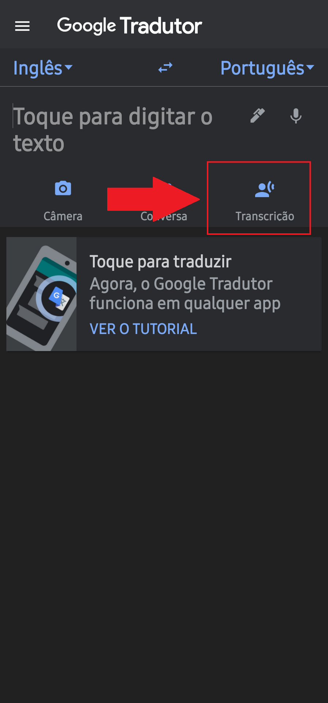
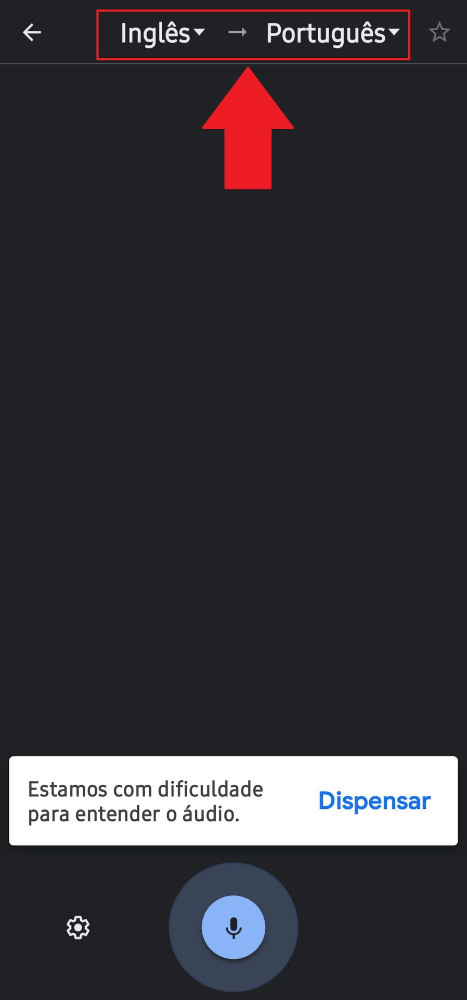
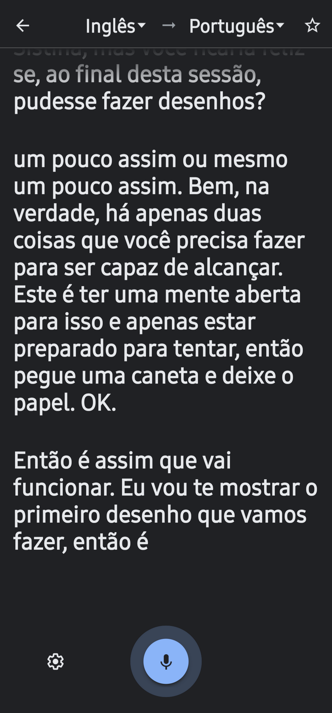

1. Acesse a loja de aplicativos do Smartphone e realize o download do aplicativo **Google Tradutor**:

 * Para Android pesquisar pelo nome do aplicativo na Play Store ou utilizar o link abaixo:
	* https://play.google.com/store/apps/details?id=com.google.android.apps.translate&26hl=pt-BR

* Para Iphone pesquisar pelo apllicativo na App Sotore ou utilizar o link abaixo:
	* https://apps.apple.com/br/app/google-tradutor/id414706506 
	
2. Abra o aplicativo e clique na função **Transcrição**;

4. Verifique se o idioma está selecionad como **Inglês** para **Português**

6. Posicione o Smartphone próximo ao auto falante para que o aplicativo possa captar o áudio;

8. Após esses passos a transcrição ocorrerá automaticamente;

