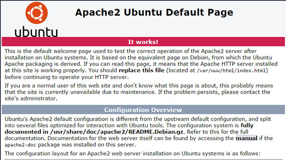

# How To Install LAMP Stack on Ubuntu 20.04


In this tutorial, we will show you how to install the LAMP stack on Ubuntu 20.04. For those of you who didn’t know, LAMP represents a full-featured stack containing the most popular web server known as Apache, the most popular database server MySQL and the most popular open-source web programming language known as PHP. All components are free and open-source software, and the combination is suitable for building dynamic web pages.

This article assumes you have at least basic knowledge of Linux, know how to use the shell, and most importantly, you host your site on your own VPS. The installation is quite simple. I will show you through the step-by-step installation of LAMP (Linux Apache, MySQL, and PHP) on Ubuntu 20.04 (Focal Fossa). You can follow the same instructions for Ubuntu 18.04, 16.04, and any other Debian-based distribution like Linux Mint.

## Install LAMP Stack on Ubuntu 20.04 Focal Fossa

Step 1. First, make sure that all your system packages are up-to-date by running the following `apt` commands in the terminal.

```
sudo apt update
sudo apt upgrade
```

Step 2. Installing Apache.

Apache Webserver packages are available on Ubuntu 20.04 official repositories. We will be installing Apache with apt, which is the default package manager for ubuntu:

```
sudo apt install apache2 apache2-utils
```

Once installing Apache2, the commands below can be used to stop, start, and enable Apache2 service to always start up with the server boots:

```
sudo systemctl enable apache2
sudo systemctl start apache2
sudo systemctl status apache2
```

You can verify that Apache is really running by opening your favorite web browser and entering the URL `http://your-ip-server's-address`, if it is installed, then you will see this:



Step 3. Installing MariaDB.

MariaDB is a relational database management system forked from MySQL. It is free and Open-source. Install MariaDB using the following commands:

```
sudo apt install software-properties-common mariadb-server mariadb-client
```

Once installing MariaDB, the commands below can be used to stop, start, and enable the MariaDB service to always start up when the server boots:

```
sudo systemctl status mariadb
sudo systemctl enable mariadb
sudo systemctl start mariadb
```

By default, MariaDB is not hardened. You can secure MariaDB using the `mysql_secure_installation` script. you should read and below each step carefully which will set a root password, remove anonymous users, disallow remote root login, and remove the test database and access to secure MariaDB:

```
mysql_secure_installation
```

Configure it like this:

```
-  Set root password?  [Y/n] y -  Remove anonymous users?  [Y/n] y -  Disallow root login remotely?  [Y/n] y -  Remove test database and access to it?  [Y/n] y -  Reload privilege tables
```

To log into MariaDB, use the following command (note that it’s the same command you would use to log into a MySQL database):

```
mysql -u root -p
```

Step 4. Installing PHP 8 on Ubuntu.

Now we add a third-party PPA to Ubuntu:

```
sudo add-apt-repository ppa:ondrej/php
```

Then, you can update the packages cache in the system and install PHP packages:

```
sudo apt update
sudo apt install php8.0 libapache2-mod-php8.0
```

After installing, you can restart Apache using the following commands:

```
sudo systemctl restart apache2
```

Once successfully installed, you can confirm the using the following command:

```
$ php -v
```

```
HP 8.0.0RC3  (cli)  (built:  Dec  16  2020  18:16:36)  ( NTS )  Copyright  (c)  The PHP Group  Zend  Engine v4.0.0-dev,  Copyright  (c)  Zend  Technologies  with  Zend  OPcache v8.0.0RC3,  Copyright  (c),  by  Zend  Technologies
```

Step 5. Installing PHP 8 Extensions.

To install PHP 8 extensions on Ubuntu 20.04 using the command syntax:

```
sudo apt install php8.0-[extension]
```

Some available extensions are as shown below:

```
sudo apt install php8.0-amqp  php8.0-common   php8.0-gd         php8.0-ldap       php8.0-odbc       php8.0-readline   php8.0-sqlite3    php8.0-xsl php8.0-apcu       php8.0-curl       php8.0-gmp        php8.0-mailparse  php8.0-opcache    php8.0-redis      php8.0-sybase      php8.0-ast        php8.0-dba        php8.0-igbinary   php8.0-mbstring   php8.0-pgsql      php8.0-rrd        php8.0-tidy       php8.0-yaml php8.0-bcmath     php8.0-dev        php8.0-imagick    php8.0-memcached  php8.0-phpdbg     php8.0-smbclient  php8.0-uuid       php8.0-zip php8.0-bz2        php8.0-ds         php8.0-imap       php8.0-msgpack    php8.0-pspell     php8.0-snmp       php8.0-xdebug     php8.0-zmq php8.0-cgi        php8.0-enchant    php8.0-interbase  php8.0-mysql      php8.0-psr        php8.0-soap       php8.0-xhprof php8.0-cli        php8.0-fpm        php8.0-intl       php8.0-oauth      php8.0-raphf      php8.0-solr       php8.0-xml
```

An example to install a few more useful extensions:

```
sudo apt install php8.0-cli php8.0-common php8.0-fpm php8.0-redis php8.0-snmp php8.0-xml
```

Step 6. Test PHP.

To test PHP, create a text file named `info.php` with the content below. Save the file, then browse to it to see if PHP is working:

```
nano /var/www/html/info.php
```

In this file, paste the following code:

```
<?php
phpinfo();  ?>
```

Try to access it at `http://ip-address/info.php`. If the PHP info page is rendered in your browser then everything looks good and you are ready to proceed further.

Congratulations! You have successfully [installed the LAMP stack](https://idroot.us/install-lamp-stack-centos-8/). Thanks for using this tutorial for installing LAMP (Linux [Apache](https://www.apache.org/), [MySQL](https://www.mysql.com/), and [PHP](https://php.net/)) in Ubuntu 20.04 Focal Fossa system. For additional help or useful information, we recommend you to check the official Apache, MySQL, and PHP website.

VPS Manage Service Offer
___
fonte: https://idroot.us/install-lamp-stack-ubuntu-20-04/

