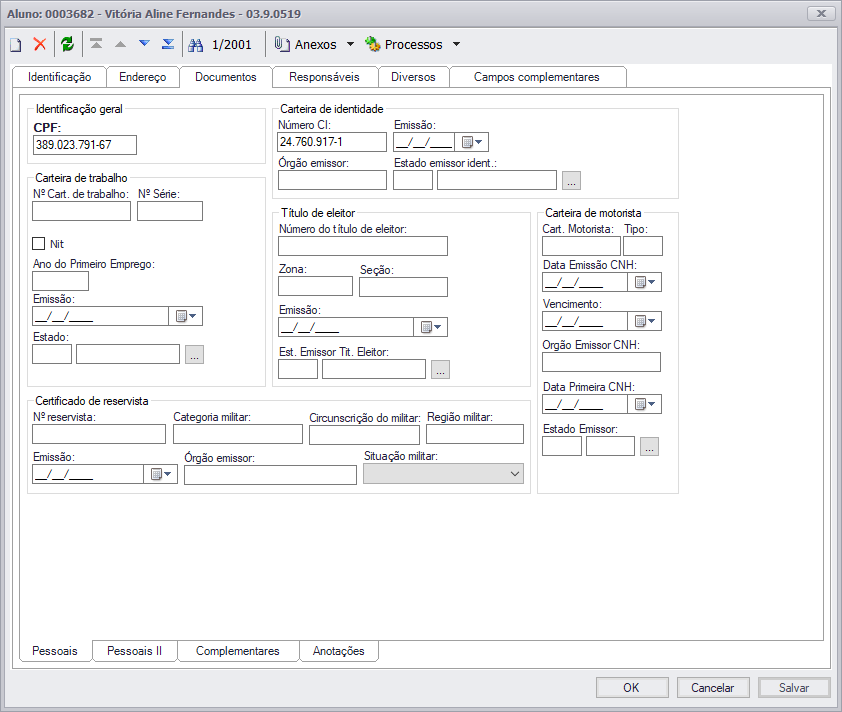

## Integração de Dados

De qual forma os dados serão integrados?
1. Manualmente via arquivo.
> Baixar o arquivo de um sistema e subir para o outro sistema.

2. Automaticamente via agendamento.
> Utilizar a ferramento **conceito** da TOTVS para realizar as integrações.

## Faturamento Alunos
1.  Criar Auno no TOTVS utilizando os dados enviados pelo TUTOR:
>Dados Básicos
> * RA
> * Nome
> * Estado Natal 
> * Naturalidade
> * Data de Nascimento
> * Email

> Endereço:
> * CEP
> * Logradouro
> * Número
> * Bairro
> * Estado

> Documentos:
> CPF
> Carteira de Identidade

> Campos Complementares
> * CRM
> Observação: caso CRM não seja necessário, remover obrigatoriedade do campo.

> Responsáveis:
> * Responsável Financeiro

> O setor Financeiro utilizará o **Aluno** importado para criar o plano de pagamento. 

>Gerar as **Parcelas**.  
  

> Selecionar o **Serviço** que foi criado previamente com o nome e valor total do curso.

>Preencher os dados necessários, acessar as parcelas e gerar os **Lançamentos**.

2. Levar o nome do Serviço (nome do curso) para o Histórico do Lançamento Financeiro.

3. Os Relatórios Financeiros terão que ser alterados, pois os dados irão ser buscados de outro local.
4. Disponibilizar Dados Financeiros e NFS-e para o aluno no Portal do Aluno TUTOR 
> Depende da decisão de qual forma será a integração dos dados.

## Demandas Gerais TOTVS

1. Envio de NFS-e por e-mail. 
> Depende de:
> * Parametrização do faturamento dos Alunos
> * Parametrizar para não puxar notas canceladas

2. Verificação do Layout dos relatórios de NFS-e das prefeituras de BH e SP.
> Totvs recebe XML como retorno da prefeitura, sendo assim, necessário utilizar os relatórios
> Depende da parametrização do faturamento dos Alunos

3. Parametrizar o movimento de RPS (2.1.00) para que seja enviado automaticamente e parametrizar o job para consulta automática.
> Impedir retrabalho nos movimentos 2.1.XX

4. Trazer do Saúde a Discriminação do Procedimento (RM Saúde)  para o campo Histórico (RM > Gestão de Estoque Compras e Faturamento) nos movimentos 2.1.01 e 2.1.03 (pedido de venda).
>Discriminação de Procedimentos deve ser baseada na tabela que o setor Financeiro utiliza.
5. Avaliação do movimento 2.2.02 – RECEBIMENTO REF. PROCEDIMENTO SCULPTRA para que funcione corretamente e padronizar para que apareça no Extrato do Caixa da Recepção.
6. Personalizar relatório  Extrato do Caixa da Recepção ( criar uma tabela com os cabeçalhos Procedimento, Quantidade, Valor, Valor Total (quantidade x valor) e na ultima linha o valor total de todos os procedimentos somando o cabeçalho Valor Total.
7. Baixar todos os lançamentos via comando no banco de dados.
> De uma única vez.

## Demandas Gerais TUTOR

1. Retirar obrigatoriedade de preencher dados financeiros na matrícula do aluno.
> Em contato com o Raphael da TUTOR fui informado que para isso basta colocar o valor do curso como R$ 0,00.

2. Utilizar a pré-matrícula.
>Aguardando resposta da Elaine referente a utilizar ou não a pré-matrícula para pagamento da taxa de inscrição.

3. Enviar dados do Aluno para o TOTVS
>Aguardando decisão de qual forma serão enviados esses dados (manual, automática).

4. Receber dados financeiros e NFS-e da TOTVS
>Aguardando decisão de qual forma serão enviados esses dados (manual, automática).

	

	

