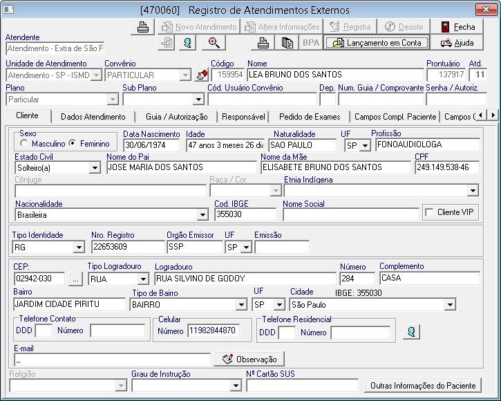
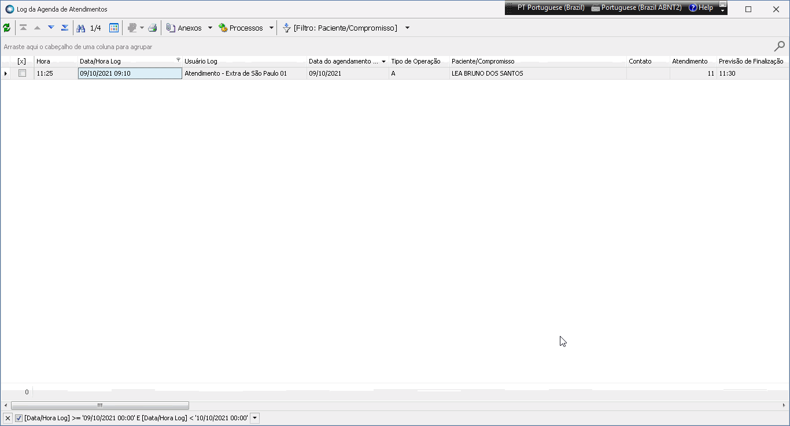
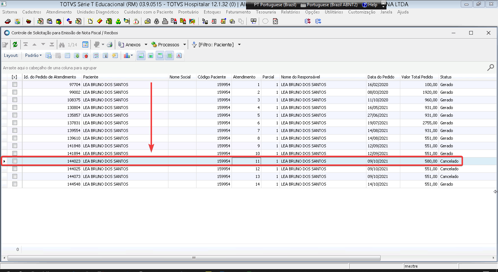
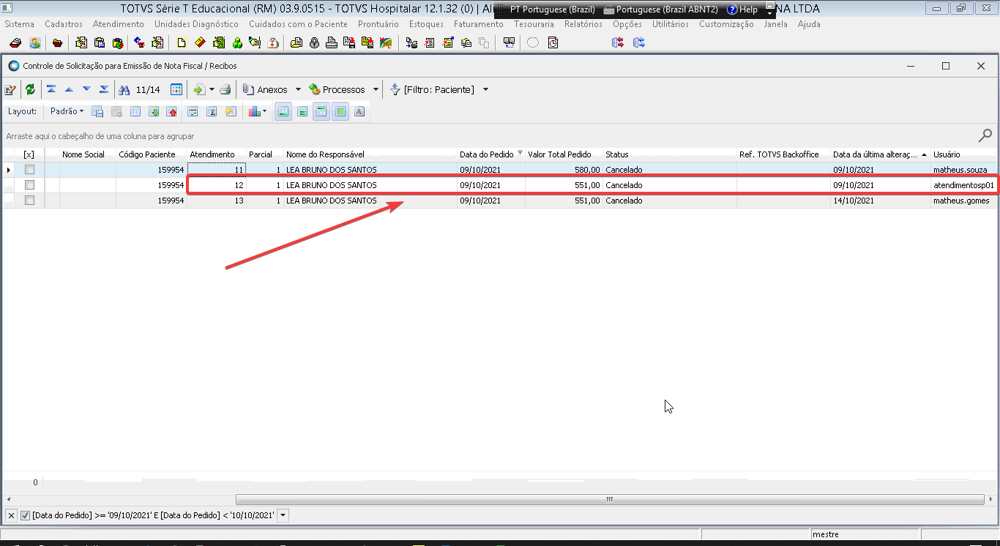
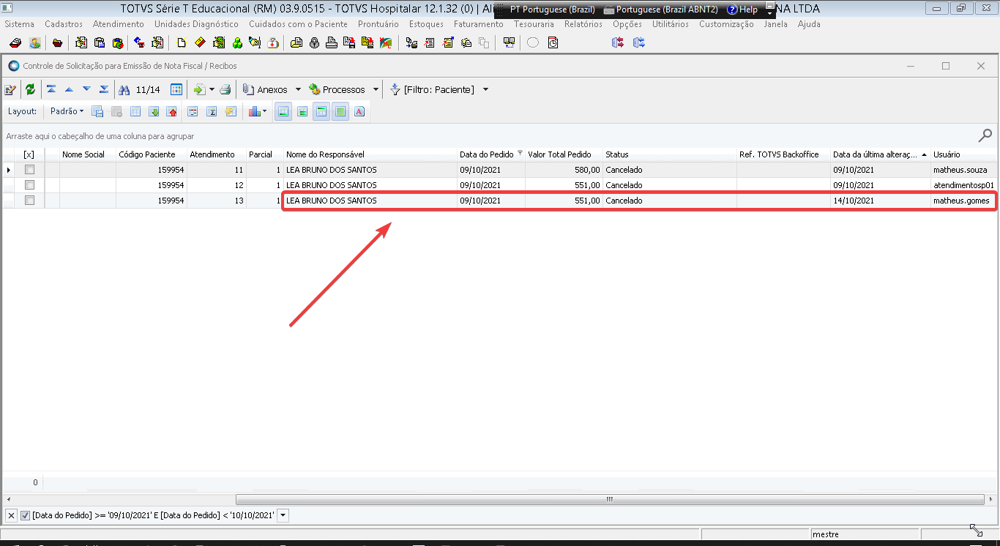
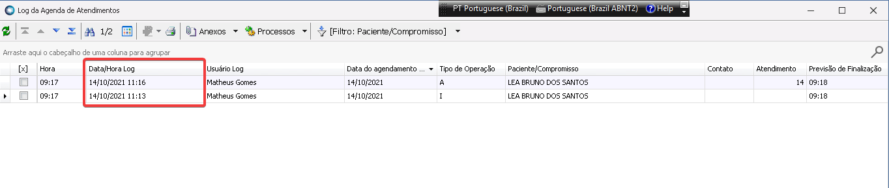
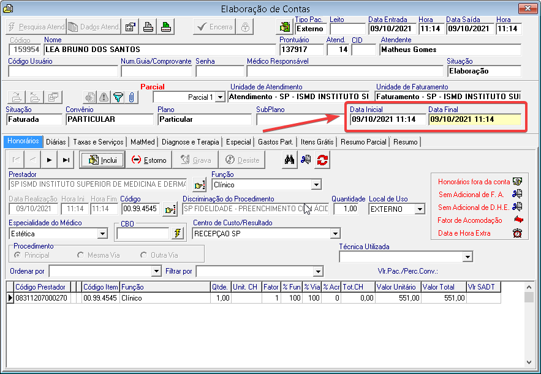
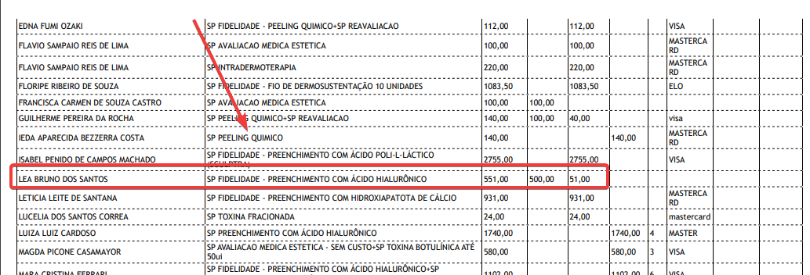
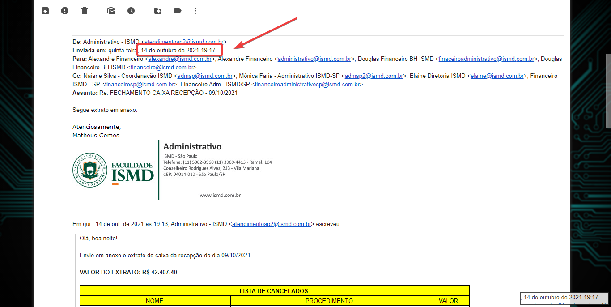
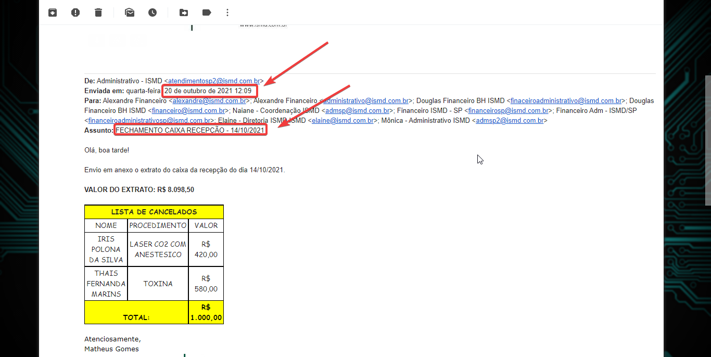

## Dia 09/10/2021

1. **Atendimento - Extra de São Paulo 01** abriu ficha da paciente **LEA BRUNO DOS SANTOS** na agenda **Agenda SP21 GRUPO 4**

**Cancelamento** realizado no dia **09/10/2021** pelo usuário **matheus.souza**.

2. **Atendimento - Extra de São Paulo 01** abriu ficha da paciente **LEA BRUNO DOS SANTOS** na agenda **Agenda SP21 GRUPO 2**

**Cancelamento** realizado no dia **09/10/2021** pelo usuário **atendimentosp01**.

3. **Atendimento - Extra de São Paulo 01** abriu ficha da paciente **LEA BRUNO DOS SANTOS** na agenda **Agenda SP21 GRUPO 1**

**Cancelamento** realizado no dia  **09/10/2021** pelo usuário **matheus.souza**.

## Dia 14/10/2021
1. Ás **11:16** do dia **14/10/2021** o usuário **Mathues Gomes** abriu ficha da paciente **LEA BRUNO DOS SANTOS** na agenda **AMB SEMANAL ESTETICA 3**, com a data do atendimento alterada manualmente para o dia **09/10/2021**, por  esse fato o lançamento aparece no extrato de caixa do dia **09/01/2021**.

2. Ás **19:17** do dia **14/10/2021** o fechamento de caixa do dia **09/10/2021** foi enviado para o setor Financeiro de BH via e-mail, contendo as informações  dos cancelamentos da paciente **LEA BRUNO DOS SANTOS** realizados no dia **09/10/2021**.

## Dia 20/10/2021

1. Ás **12:09** do dia **20/10/2021** o fechamento de caixo do dia 14/10/2021 foi enviado para o setor Financeiro de BH via e-mail. 

