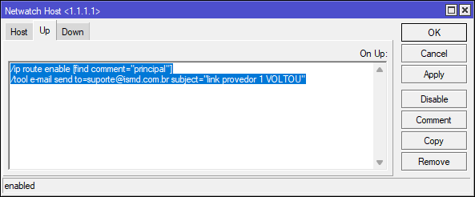

1. Comentar Rotas "principal" e "secundaria"
	
3. Criar Rotas de Ping
* 1.1.1.1 Gateway Oi
* 1.0.0.1 Gateway Claro
	
4. Configurar Email 

4. Configurar Netwatch 1.1.1.1 e 1.0.0.1
	
	
	
5. Testar funcionamento via regra de firewall
	
	
