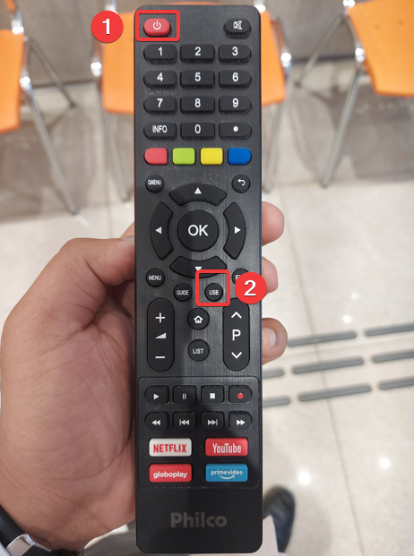
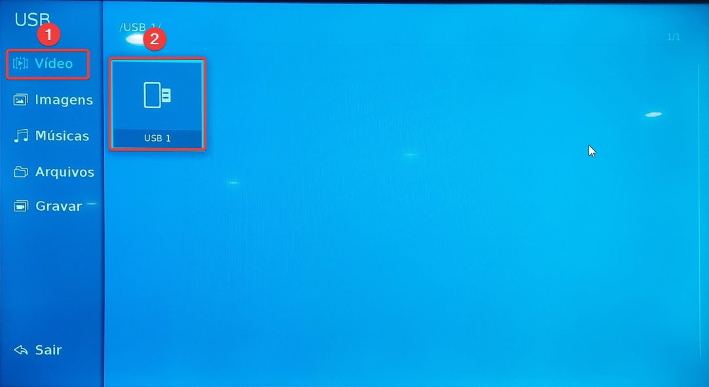
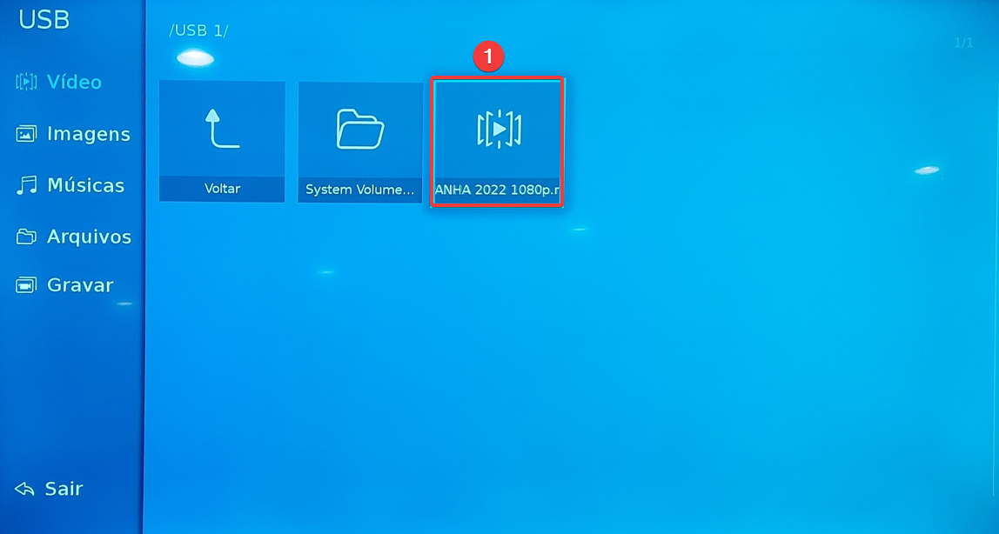

# 1. **LIGAR** A TV E PRESSIONAR O BOTÃO **USB**

# 2. SELECIONAR A OPÇÃO **VIDEO** NO MENU LATERAL E CLICAR **USB 1**

# 3. CLICAR NO **VIDEO** 

# 4. APOS OS PASSOS ANTERIORES O VÍDEO SERÁ REPRODUZIDO, AO FINAL DO DIA **DESLIGAR** A TV

