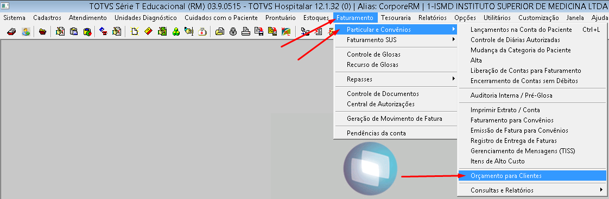
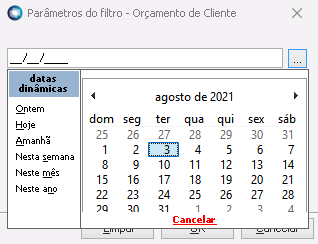
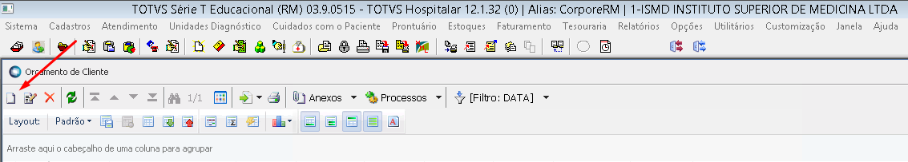
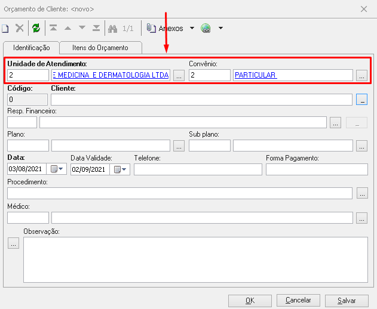
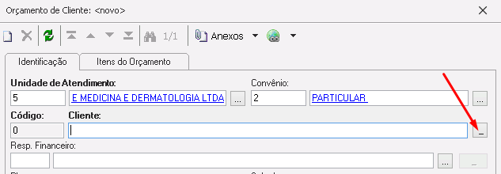
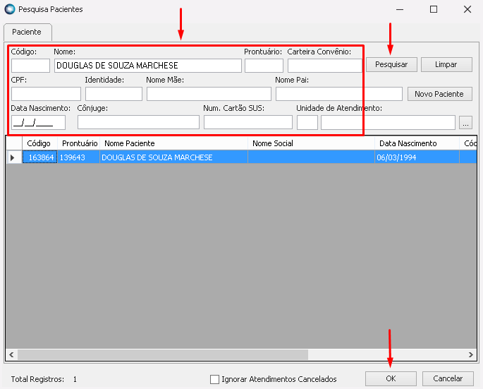

## 1.  PAGAMENTO ANTECIPADO
1. No RM SAÚDE clicar em **Faturamento > Particular e Convênios > Orçamento para Clientes**       

          
1. Selecionar a **DATA**                                                                                                                               

1. Clicar em **Incluir**    
 

                                                                                                                                
1.  Na  aba **Identificação** e preencher os campos:
	 - Unidade de atendimento:  **preencher com o número 2 para Unidade BH e 5 para UnidadeSP**    
	 -  Convênio: **preencher com o número 2 - PARTICULAR**

                                                                                    
1. Incluir o cliente, clicando no botão de inclusão

1. Preencher algum filtro de pesqueisa do paciente (Código, Nome, Prontuário, CPF...), clicar em **Pesquisar**, é após localizar o nome correto clicar em **OK**

	-  Cliente
	-  Resp. Financeiro automaticamente (caso não tenha posso incluir)
	-  Plano
	-  Data (automaticamente, dia do pagamento)
	-  Data Validade (data do procedimento)
1. Aba Itens de Orçamento > Incluir
	-  Procediemntos Serviço
	-  
	-  Preencher código 00010685 e clicar em 3 pontinhos
	-  Selecionar o Ítem Sculptra relativo ao atendimento
	-  Clicar em ok
	-  Conferir Quantidade e Valores e clicar em salvar
1. Aba Pagamento ISMD > Incluir
	-  Preencher as formas de pagamento e clicar em ok
	- Clicar em Salvar
1. Anexos > Relatórios > TERMO SCULPTRA-ISMD.FS.103
	-  Imprimir termo Sculptra 2 Vias (uma recepção uma paciente)
	- Recepção bate Carimbo PAGO, data e assina
	- Termo contém usuário, data e hora. 
	
## 2. AGENDAMENTO
1. Escrever a observação que foi pago no agendamento

## 3. EXTRATO DE CAIXA DIA DO PAGAMENTO

1. Relatórios > Gerador.NET (Preview)
	- Selecionar relatório ISMD.22 - EXTRATO DE CAIXA - RECEPÇÃO - NOVO
	- Preencher DATA e MÉDICO(A)
	- Imprimir 

## 4. DIA DO ATENDIMENTO
- **30 DE JULHO - DOUGLAS DE SOUZA MARCHESE** 
- **ID 477552**
1. Atendimento Externo > Campos Compl. Atend.
	- Preencher o ID SCULPTRA
	
1. Atendimento Externo > Lançamento em Conta > Honorários > Incluir
	-  Pesquisar **'Pagamento Antecipado'**
	-  Grava
	-  Encerra
1. Atendimento Externo > Imprimir > Cópia de ATENDIMENTO BH-SP

## 5. RELATÓRIO
1. Relatórios > Gerador.NET (Preview) > ISMD.FS.104 - SCULPTRA - PAGAMENTO ANTECIPADO PACIENTE
- CPF: **12170617620**

