## 1. PAGAMENTO ANTECIPADO DO SCULPTRA

1.  Clicar em **Faturamento > Particular e Convênios > Orçamento para Clientes**;
    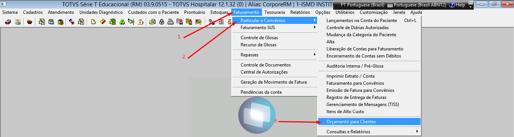
    
2.  Selecionar a **Data**;
    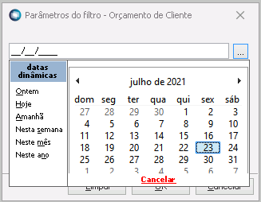
    
3.  Clicar em **Incluir**;
    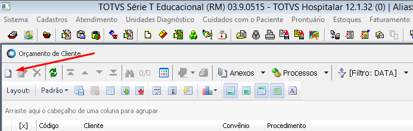
    
4.  Preencher a **Unidade de Atendimento** (2 para BH e 5 para SP) e o **Convênio** (2 - PARTICULAR);
    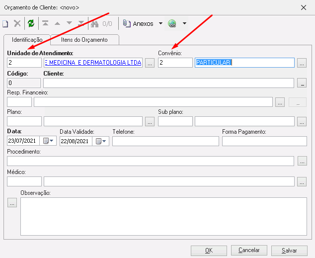
    
5.  Incluir o **Cliente**, clicando no botão indicado abaixo;
    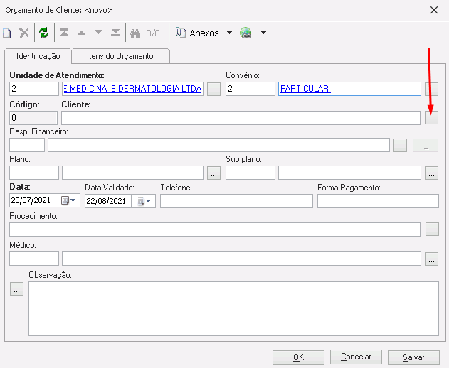
    
6.  Pesquisar pelo paciente e clicar em **OK**;
    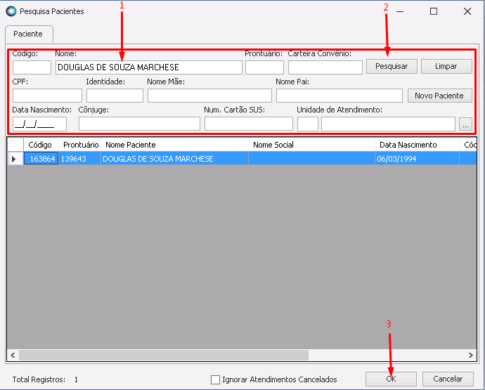
    
7.  Ao selecionar o **Cliente**, o **Responsável Financeiro** será automaticamente preenchido;
    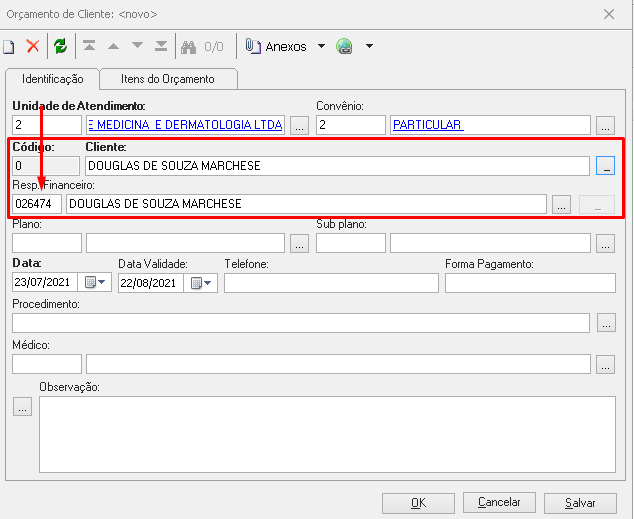
    
8.  Em **Data Validade** preencher com a data agendada para o procedimento;
    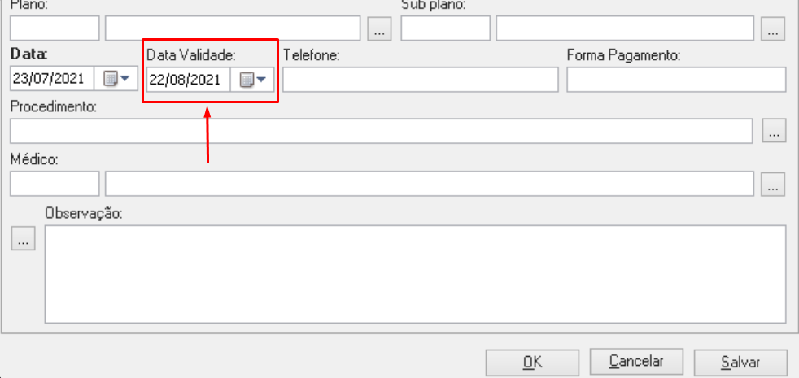
    
9.  Preencher o **Plano** (1 - Particular) e a(o) **Médica(o)**;
    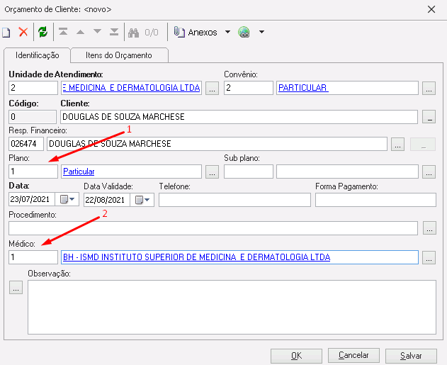
    
10. Clicar na aba **Itens do Orçamento** e logo após clicar em **Incluir**;
    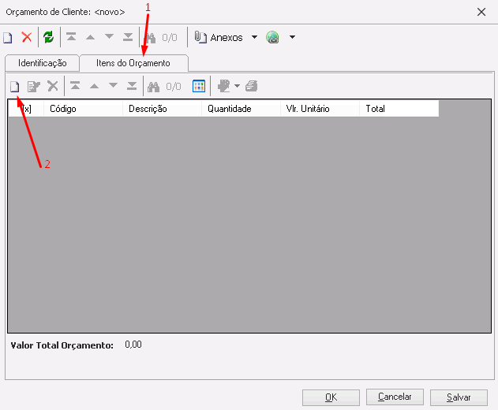
    
11. Clicar em **Procedimentos/Serviço**;
    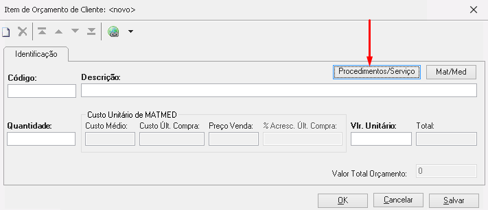
    
12. Preencher o código do procedimento conforme referência abaixo:
    
    - **00.01.0685 para BH - PREENCHIMENTO COM ÁCIDO POLI-L-LÁTICO (SCULPTRA)**
    - **00.00.0299 para BH FIDELIDADE - PREENCHIMENTO COM ÁCIDO POLI-L-LÁTICO (SCULPTRA)**
    - **00.99.4588 para SP FIDELIDADE - PREENCHIMENTO COM ÁCIDO POLI-L-LÁTICO (SCULPTRA)**
    - **00.01.0464 para SP PREENCHIMENTO COM ÁCIDO POLI-L-LÁTICO (SCULPTRA)**

Após isso, clicar no botão de **"três pontinhos"**, selecionar o procedimento e clicar em OK;
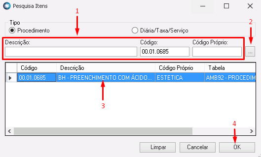

13. Selecionar a **Quantidade** e clicar em **OK**;
    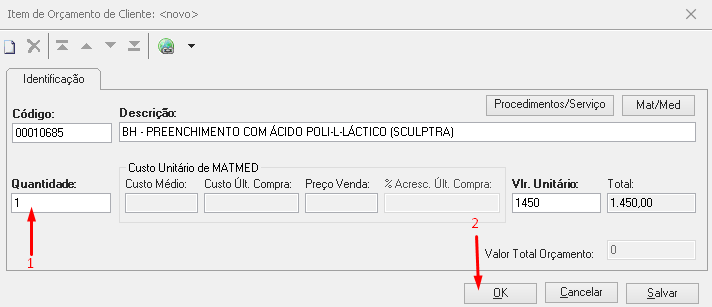
    
14. Clicar em **Salvar**;
    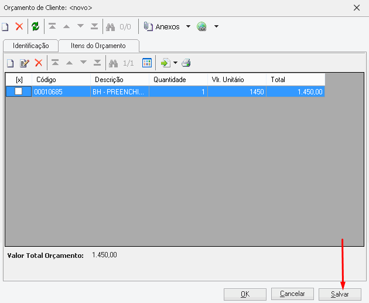
    *Após clicar em **Salvar** a aba **Pagamento ISMD** irá ficar disponível*
    
15. Clicar na aba **Pagamento ISMD**, e em **Incluir**;
    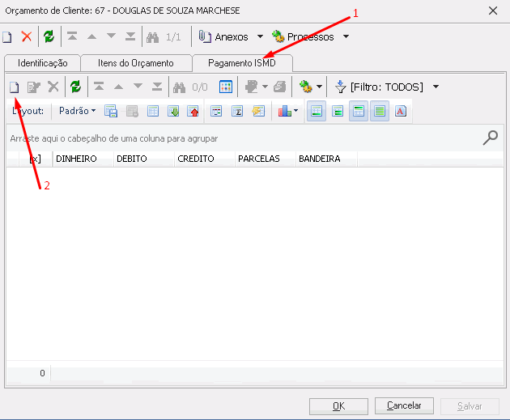
    
16. Preencher as formas de pagamento e clicar em **Salvar**;
    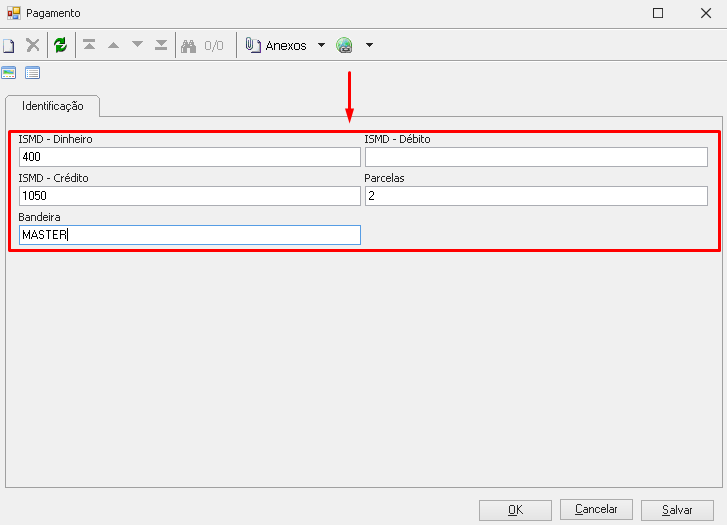
    
17. Clicar em **OK**;
    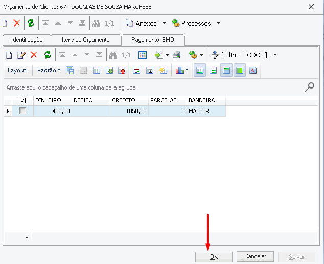
    
18. Selecionar o item criado, clicar em **Processos > Movimento de Orçamento**;
    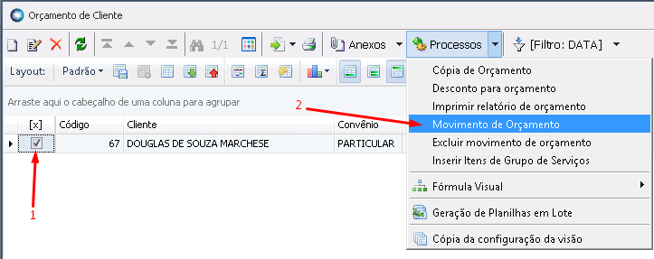
    
19. Selecionar o **Tipo de Movimento** conforme referência abaixo:
    

- **2.1.04 para BH**
- **2.1.05 para SP**

Após isso selecionar a **Condição de Pagamento** e Clicar em **OK**;
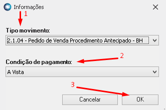

## 2. TERMO DO SCULPTRA

1.  Clicar em **Anexos > Relatórios > TERMO SCULPTRA-ISMD.FS.103** e gerar o **termo do Sculptra**;
    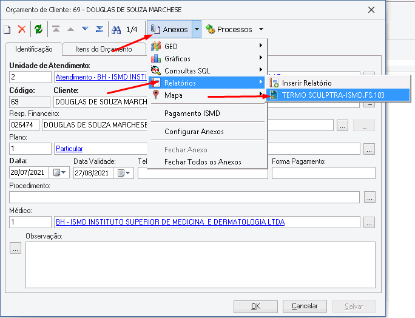
    
2.  Imprimir duas vias;
    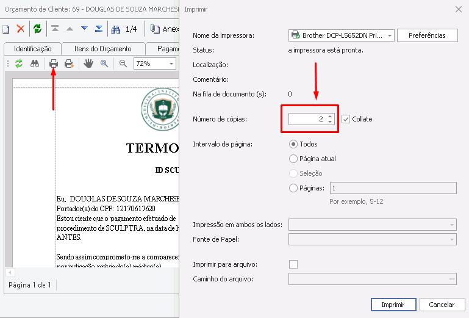
    
3.  O termo trará as informações de ID, nome e CPF do paciente, número de ampolas, valor total, data do pagamento, data do procedimento, formas de pagamento, colaborador(a) que emitiu, data e hora da emissão;
    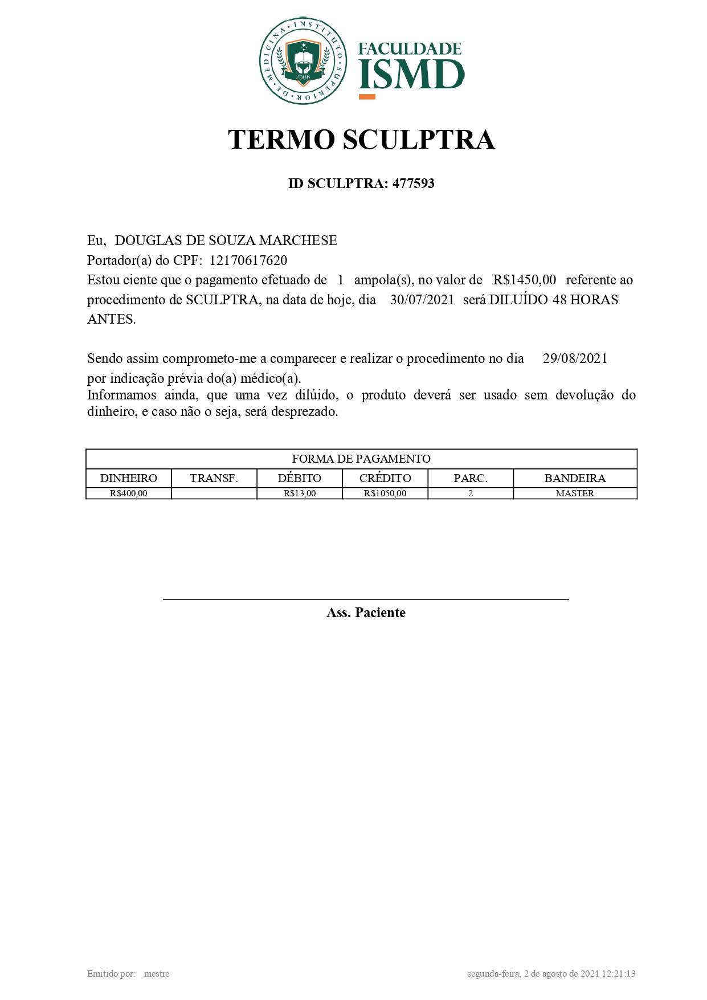
    
4.  **Colher a assinatura do Paciente, carimbar, assinar e datar o termo**. Entregar uma das vias para o Paciente e arquivar a outra;
    _pa.jpg)
    

## 3. EXTRATO DE CAIXA

1.  Para visualizar o **Pagamento do Sculptra** no **Extrato de Caixa**, clicar em **Relatórios > Gerador.NET(Preview)**;
    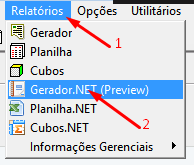
    
2.  Selecionar o Relatório **ISMD.022 - EXTRATO DE CAIXA - RECEPÇÃO - NOVO** e clicar em **Processos > Gerar Relatório**;
    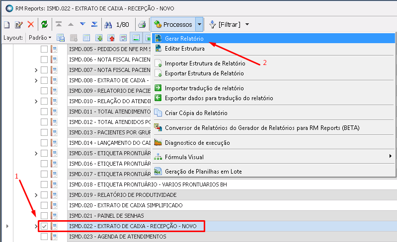
    
3.  Preencher a **Data** utilizando o padrão **DD/MM/AAAA** e o número relacionado a(o) **Médica(o)**;
    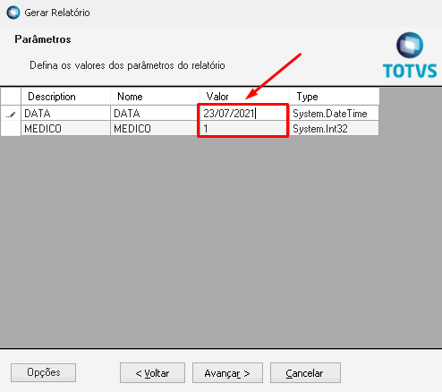
    
4.  Para imprimir o Relatório clicar no **Menu Lateral Esquerdo > Imprimir (ou Ctrl + P)**;
    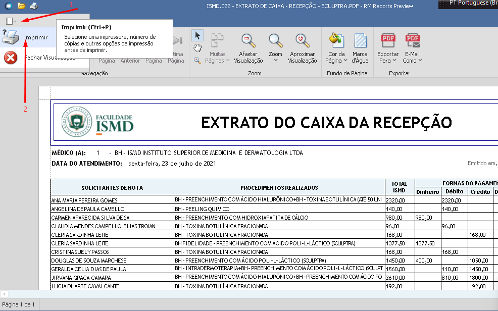
    
5.  O relatório irá trazer o **Pagamento do Sculptra** além dos outros procedimentos relativos a(o) Médica(o) selecionada(o) nos parâmetros do Relatório.
    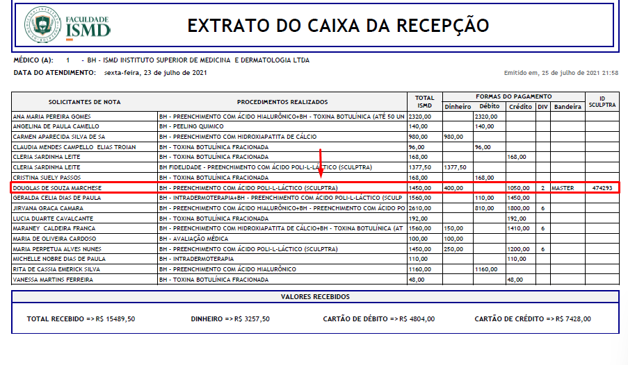
    

## 4. ATENDIMENTO (DIA DO PROCEDIMENTO)

1. No atendimento preencher o campo **ID SCULTRA**;
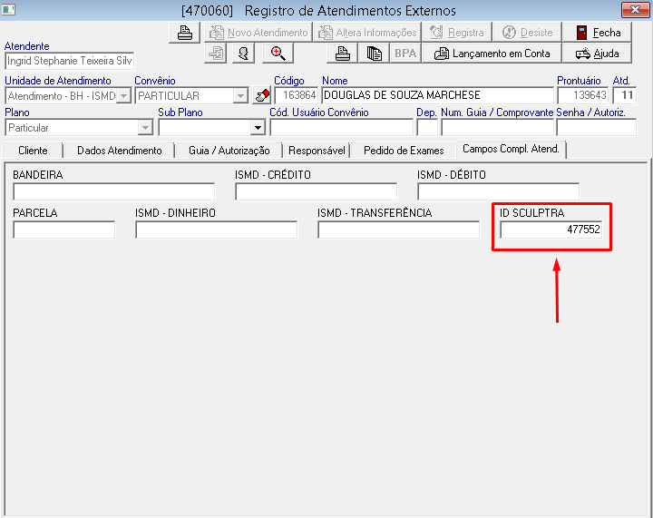

Ao preencher o ID, o atendimento irá ficar vinculado ao Pagamento do Sculptra. 

2. Na inclusão de itens pesquisar por PAGAMENTO ANTECIPADO e selecionar o procedimento correspondente ao pagamento efetuado pelo(a) paciente; 
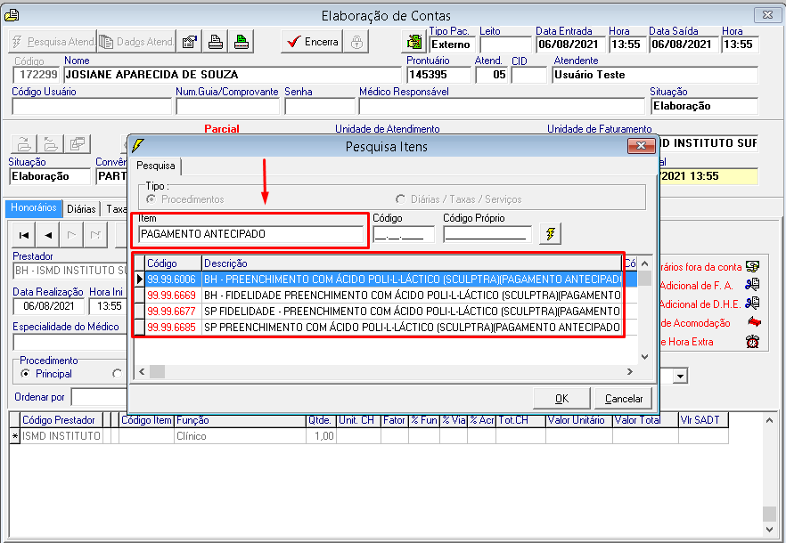

3. Com o pagamento antecipado vinculado ao atendimento, ao imprimir o **COMPROVANTE DE ATENDIMENTO E PAGAMENTO** (RELATÓRIO **2021.08.03 - ATENDIMENTO BH-SP (NOVO)**, será possível visualizar a data do pagamento antecipado, data do agendamento e o ID.
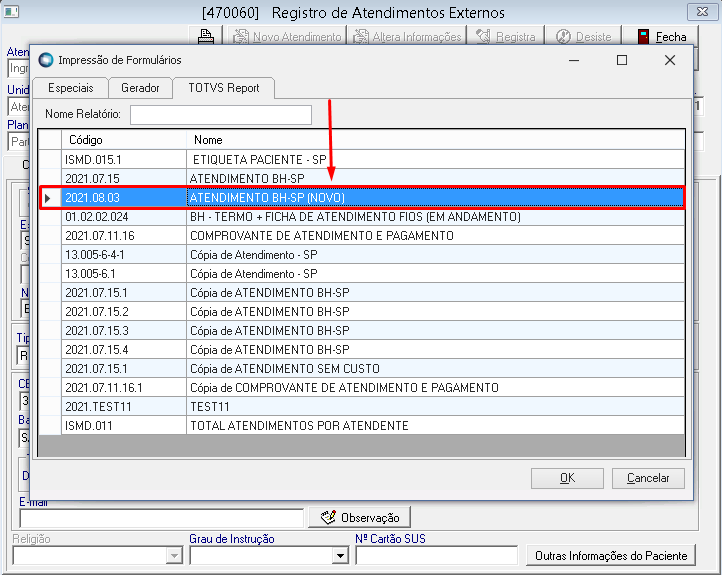
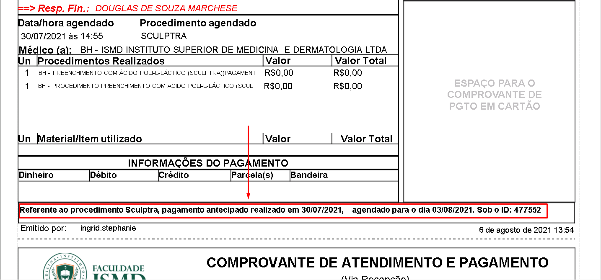

## 5. RELATÓRIO 

1. Caso seja necessário é possível confirmar o pagamento antecipado através do relatório **ISMD.FS.104 - SCULPTRA - PAGAMENTO ANTECIPADO PACIENTE**, utilizando o **CPF** do paciente (**sem ponto e traço, apenas os números**);
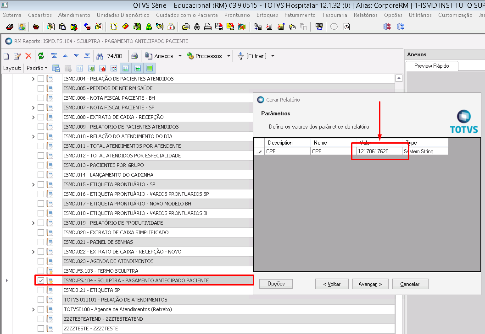

**O relatório exibe informações da data de pagamento, data de agendamento e valor pago.**
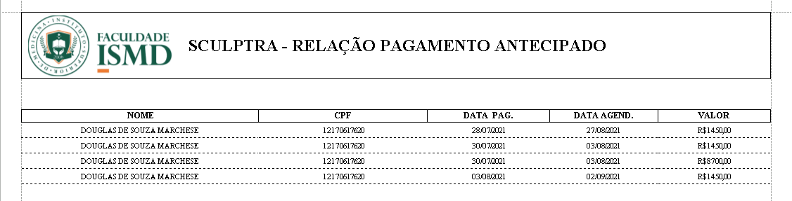

