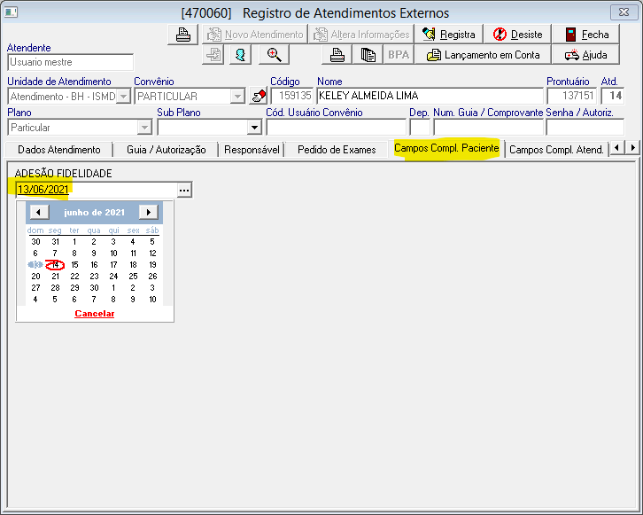
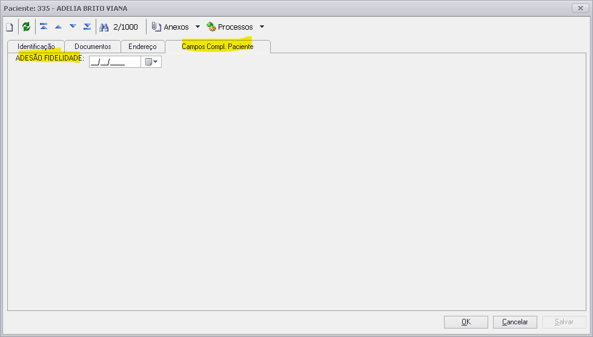
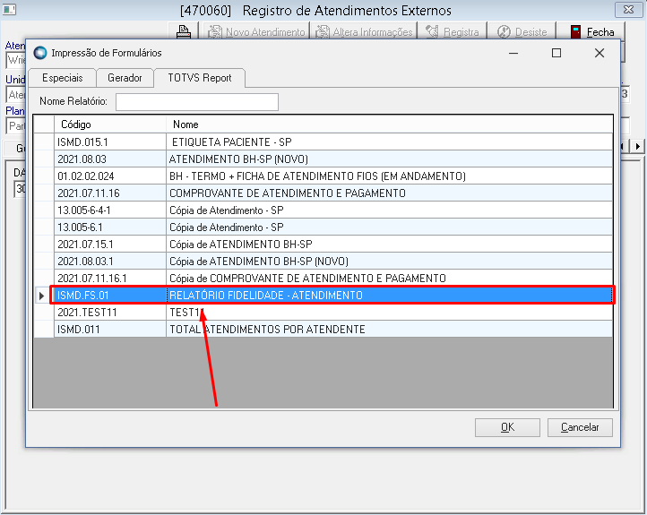
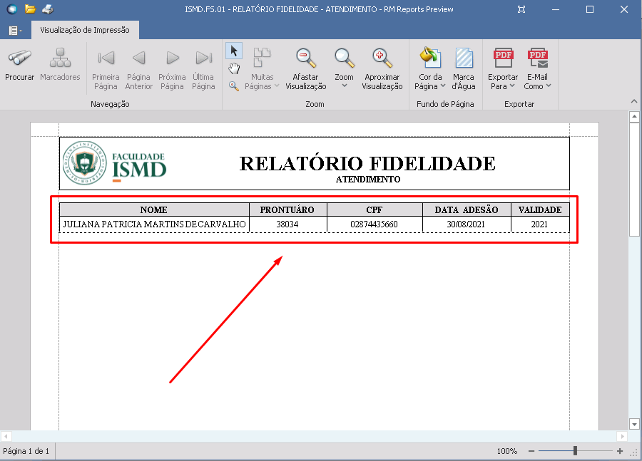
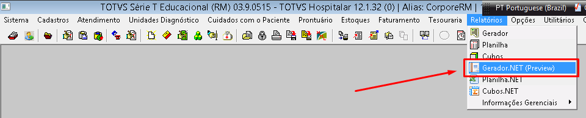
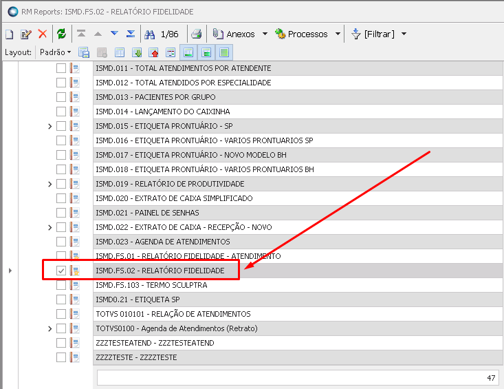
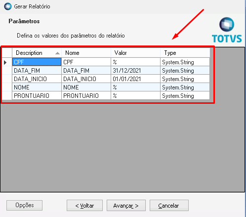
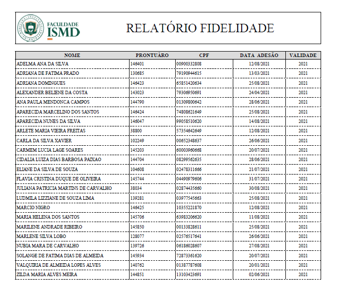

# PREENCHIMENTO 

## 1. Na Agenda de Atendimentos em Registro de Atendimentos Externos > Campos Compl. Paciente > Adesão Fidelidade

## 2. No Cadastro do Paciente em  Paciente > Campos Compl. Paciente > Adesão Fidelidade

# RELATÓRIOS

## 1. No atendimento, em TOTVS Report selecionar o relatório ISDM.FS.01 - RELATÓRIO FIDELIDADE - ATENDIMENTO

*Irá trazer automaticamente o Nome, Prontuário, CPF, Data de adesão e validade do Cartão Fidelidade do paciente.*

## 2. A segunda forma é através do gerador de relatórios, acessando o  Gerador.NET (Preview) e selecionar o relatório ISMD.FS.02 - RELATÓRIO FIDELIDADE;

## 2.1 Filtros do relatório

- **NOME =>** Preencher o nome do paciente
- **CPF =>** Preencher o CPF do paciente (apenas números, sem ponto "." e traço "-")
- **PRONTUÁRIO =>** Preencher o Prontuário do paciente
- **DATA_INICIO =>** Data inicial da busca no formato DD/MM/AAAA
- **DATA_FIM =>** Data final da busca no formato DD/MM/AAAA

*Obs: nos campos NOME, CPF e PRONTUÁRIO é possível utilizar o sinal '%' para que a busca seja realizada incluindo todos pacientes e não apenas um específico.*

