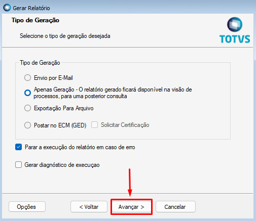
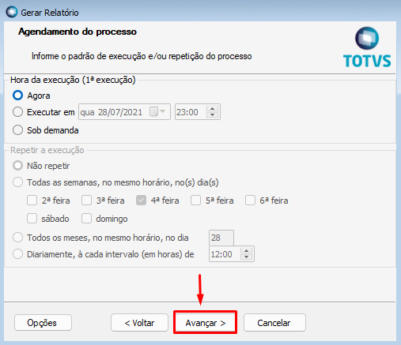

1. No TOTVS RM clicar em **Gestão > RM Reports**;

2. Clicar no filtro **RELATÓRIO ACADÊMICO**;

3. Selecionar o relatório **TOTVS.007 - RELATÓRIO ACADÊMICO** e clicar em **Gerar Relatório**;

4. Clicar em **Avançar**;

5. Clicar em **Avançar**;

6. Selecionar os Parâmetros conforme descrição abaixo e clicar em **Avançar**:
* **CPF =>** Filtra pelo CPF no aluno. O CPF deve ser digitado sem pontos e hífen.
* **Data Inicial e Data Final =>** utilizada para listar os alunos baseados na data de matricula.
* **Nome do Curso =>** Filtra pelo nome ou parte do nome do curso.
* **Nome do Aluno =>** Filtra pelo nome ou parte do nome do aluno.
* **Situação da Matricula =>** Filtra pela descrição ou parte da descrição da situação de matricula.
* **Nome da Turma =>** Filtra pelo nome ou parte do nome da turma
* **Desc. Filial =>** Filtra pelo Nome Fantasia da filial

*Quando algum dado do filtro não for preenchido de forma integral, acrescentar o símbolo **%** ao final do texto digitado.*

7. Clicar em **Avançar**;

8. Clicar em **Avançar**;

9. Clicar em **Executar**;

10. Relatório gerado.

