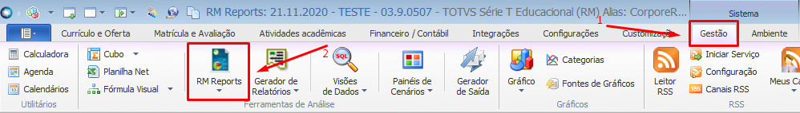
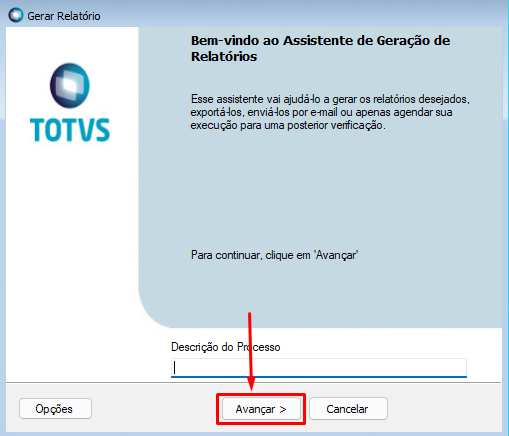
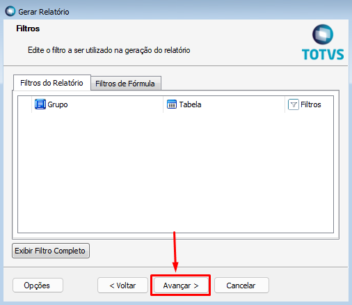
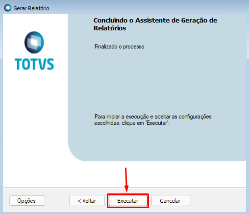

1. No TOTVS RM clicar em **Gestão > RM Reports**;

2. Clicar no filtro **RELATÓRIO CHEQUES DEVOLVIDOS**;

3. Selecionar o relatório **TOTVS.005 - CHEQUES DEVOLVIDOS** e clicar em **Gerar Relatório**;

4. Clicar em **Avançar**;

5. Clicar em **Avançar**;

6. Selecionar os Parâmetros conforme descrição abaixo e clicar em **Avançar**:
* **Data Inicial e Data Final =>** utilizada para listar os lançamentos financeiros pela data de vencimento.
* **Status =>** Filtra pelo descrição do Status preenchido no campo complementar.
* **Desc. Filial =>** Filtra pelo Nome Fantasia da filial
* **Alinea =>** Filtra pelo descrição da Alinea preenchida no campo complementar do lançamento.
* **Turma =>** Filtra pela descrição da Turma do aluno. Lembrando que um mesmo aluno pode estar em mais de uma turma, cada cheque é relacionado à parcela do modulo Educacional.
* **Aluno =>** Filtra pelo nome do aluno.
* **CPF =>** Filtra pelo CPF no aluno. O CPF deve ser digitado sem pontos e hífen.

*Quando algum dado do filtro não for preenchido de forma integral, acrescentar o símbolo **%** ao final do texto digitado.*

*O relatório irá apresentar informações dos lançamentos que possuem os campos complementares **STATUS** preenchido, **esteja com um recebimento via cheque** e o **lançamento financeiro não esteja com o status cancelado**.*

7. Clicar em **Avançar**;

8. Clicar em **Avançar**;

9. Clicar em **Executar**;

10. Relatório gerado.

