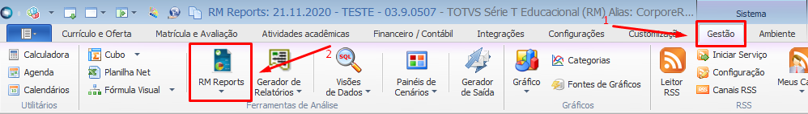
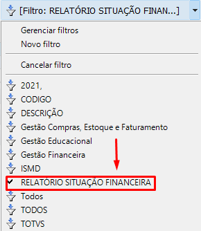
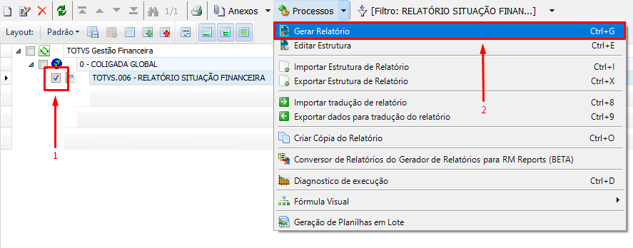
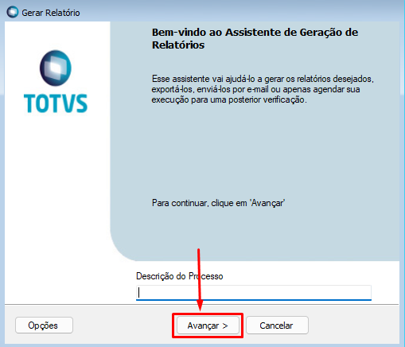
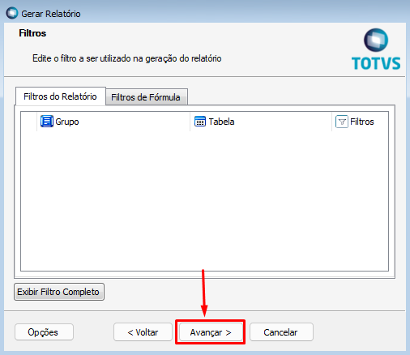
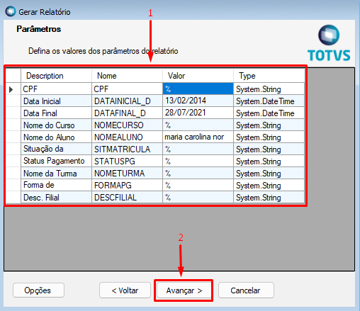
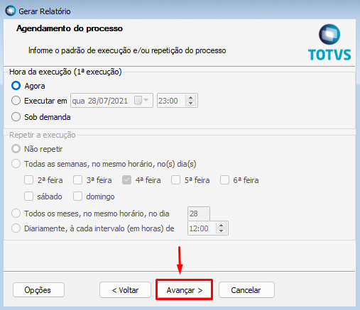
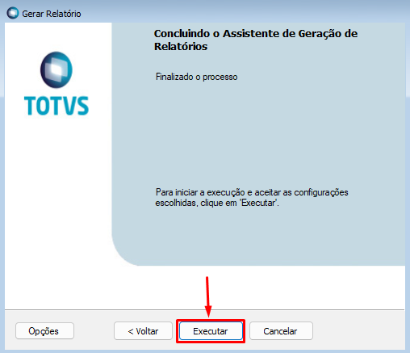
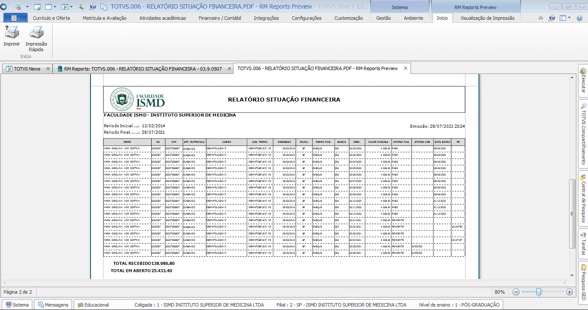

1. No TOTVS RM clicar em **Gestão > RM Reports**;

2. Clicar no filtro **RELATÓRIO SITUAÇÃO FINANCEIRA**;

3. Selecionar o relatório **TOTVS.006 - RELATÓRIO SITUAÇÃO FINANCEIRA** e clicar em **Gerar Relatório**;

4. Clicar em **Avançar**;

5. Clicar em **Avançar**;

6. Selecionar os Parâmetros conforme descrição abaixo e clicar em **Avançar**:
* **CPF =>** Filtra pelo CPF do aluno. O CPF deve ser digitado sem pontos e hífen.
* **Data Inicial e Data Final =>** utilizada para listar os lançamentos financeiros pela data de vencimento.
* **Nome do Curso =>** Filtra por nome do curso do aluno.
* **Nome do Aluno =>** Filtra pelo nome do aluno.
* **Situação da Matrícula =>** Filtra pela descrição da matrícula do aluno. (Matrícula no período letivo)
* **Status Pagamento =>** Filtra pela coluna STATUS PAG, preenchendo o descrito:
	* PAGO
	* PENDENTE
* **Nome da Turma =>** Filtra pelo nome da turma
* **Forma de Pagamento =>** Filtra pela coluna Forma Pag.
	* CHEQUE
	* TRANSFERENCIA
	* SEM CHEQUE

*Quando algum dado do filtro não for preenchido de forma integral, acrescentar o símbolo **%** ao final do texto digitado.* 

7. Clicar em **Avançar**;

8. Clicar em **Avançar**;

9. Clicar em **Executar**;

10. Relatório gerado.

