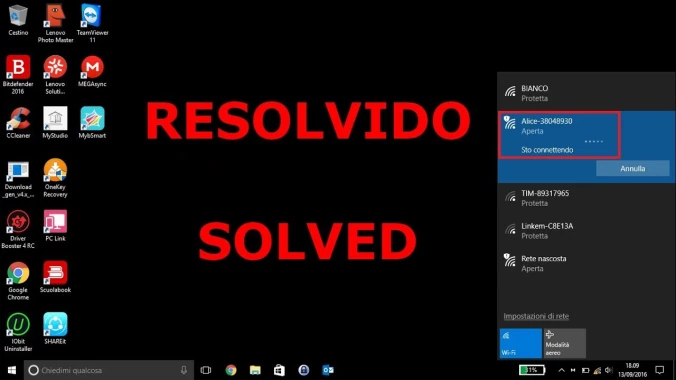
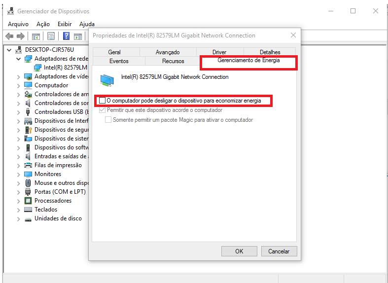
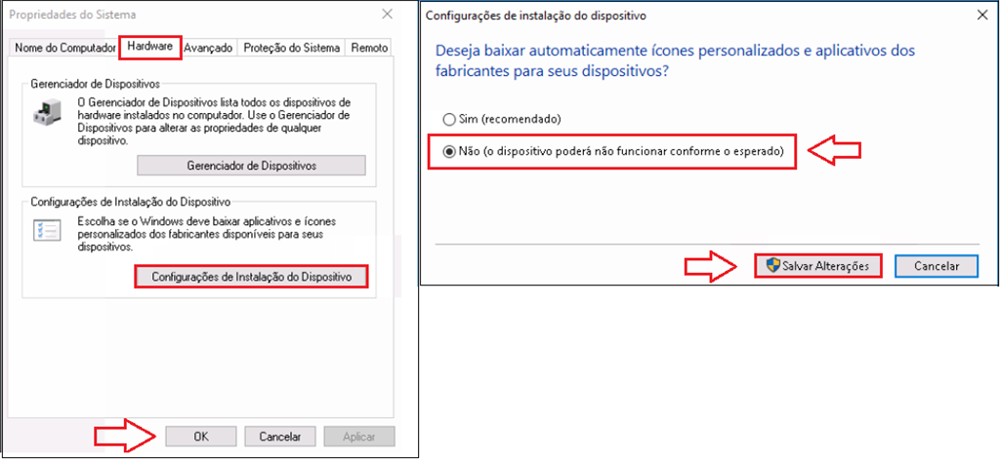
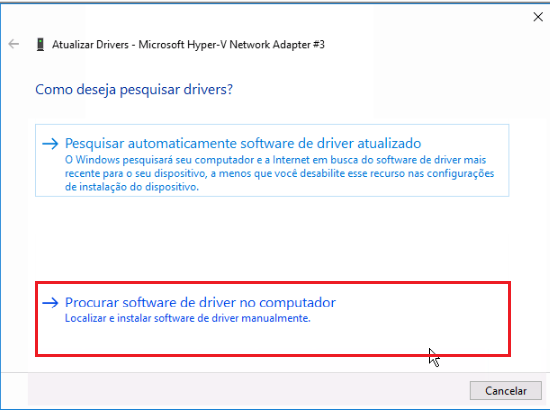
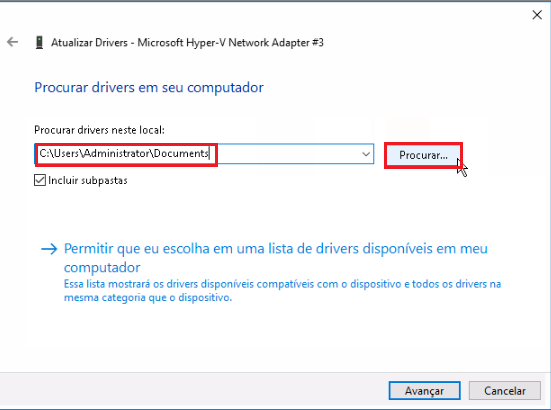
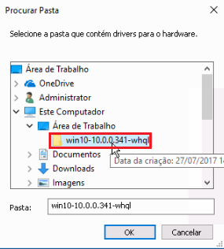
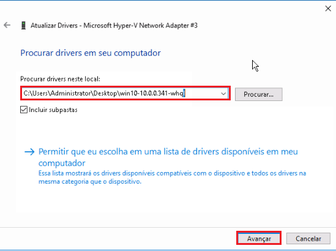

[Instabilidade Placa Wireless Qualcomm AR956x | Qualcomm AR956x Wireless Card Instability](https://www.youtube.com/watch?v=EwIAoEqTNBY)
***
## Confiram o vídeo Instabilidade Placa Wireless Qualcomm AR956x | Qualcomm AR956x Wireless Card Instability

**Configurando as opções de energia para o driver de rede:**

1. Pressione a tecla da bandeira do Windows + X, clique em Gerenciador de dispositivos.
2. Ao abrir o gerenciador de dispositivos, dê um duplo clique sobre a opção Adaptadores de rede
3. Clique com o botão direito do mouse sobre o seu adaptador de rede e clique em Propriedades
	1. Clique na guia Gerenciamento de energia e desmarque a caixa de marcação com a opção O computador pode desligar o dispositivo para economizar energia.

* Clique em OK, reinicie o computador e verifique se a dificuldade persiste.

**Alterando as configurações do plano de energia:**

1. Pressione a tecla da bandeira do Windows + X e clique em Opções de energia.
* Clique na opção Alterar configurações do plano que está à direita do plano de energia atual.
* Clique em Alterar configurações de Energia avançadas.
* Dê um duplo clique em Configurações de Adaptadores de Fio, após dê um duplo clique na opção Modo de economia de energia.
* Em Configurações, defina para Desempenho Máximo.
* Reinicie o sistema e verifique se o problema persiste.

**Desative a atualização de dispositivos:**

1. Pressione as teclas Windows + R, digite sysdm.cpl e clique em Ok
2. Clique na guia Hardware e Configurações de Instalação do Dispositivo
3. Selecione a opção Não e clique em Salvar Alterações
	1. Reinicie o sistema.

**Segundo passo:**

Vamos baixar o driver mais recente para o adaptador Qualcomm Atheros AR956x

1.Clique [aqui](https://mega.nz/#!xMBiXAJC!yq3f_DrmkJCMiSybHfwtEGANXV6nD4VmTG3uO2J-35I) abaixo para baixar a versão 10.0.0.355:

**Agora vamos instalar o driver através do gerenciador de dispositivos:**

1. Pressione a tecla da bandeira do Windows + X, clique em Gerenciador de dispositivos.
2. Expanda a sessão Adaptadores de rede com um duplo clique.
3. Clique com o botão direito do mouse sobre o driver Qualcomm Atheros AR956x e clique em Atualizar driver
4. Clique em Procurar Software de driver no computador.

5. Em seguida clique em Procurar para selecionar a pasta dos drivers que baixamos.

 2A

6. Clique em OK, e em Avançar

7. Aguarde o fim da instalação do driver e em seguida reinicie o computador.
* Faça um teste a fim de verificar se o problemas persiste.

> https://rezenhando.wordpress.com/
> *FELIPE CALABREZ*
> *29 DE AGOSTO DE 2019*

