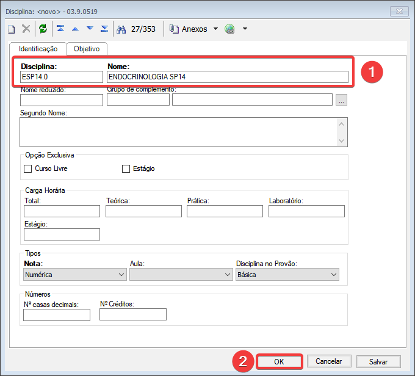

## 1.1 Acessar o **TOTVS EDUCACIONAL**  e clicar em **CURRICULO E OFERTAS > DISCIPLINAS > INCLUIR**

## 1.2  Preencher o código (letras iniciais do nome da disciplina, ponto (.), carga horária) após isso, preencher o nome da disciplina e clicar em OK.

