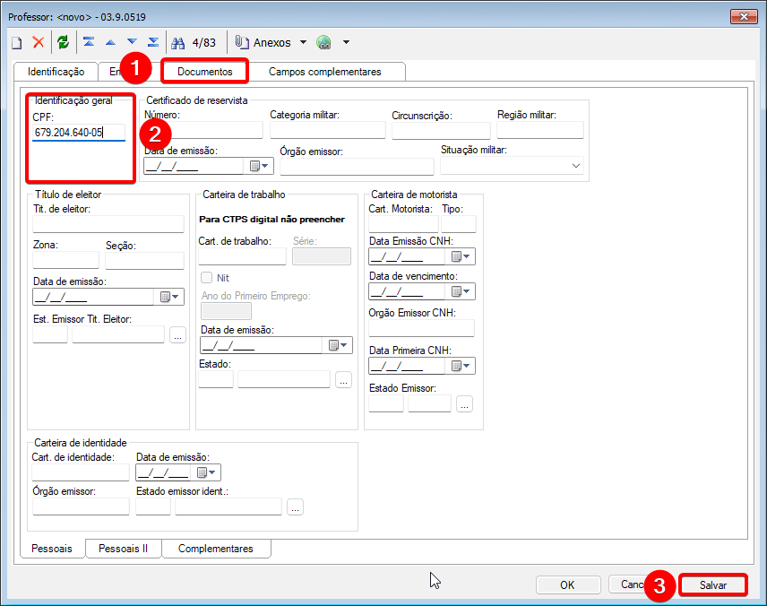
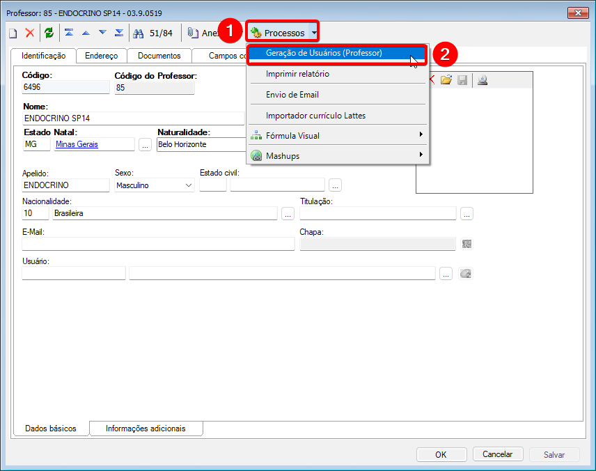
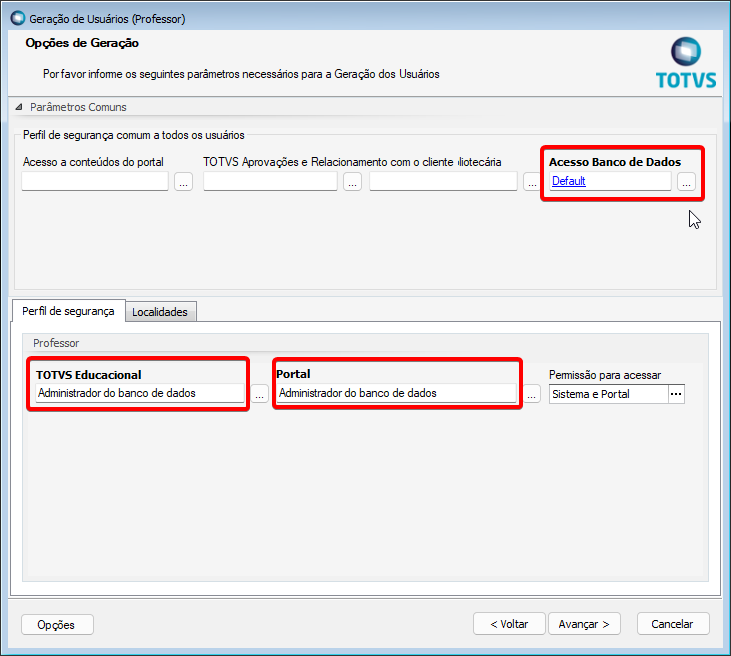
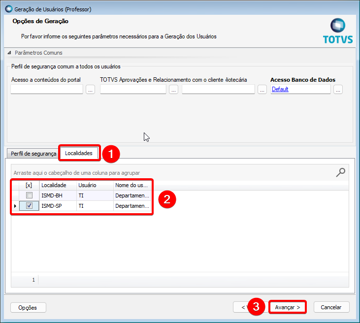
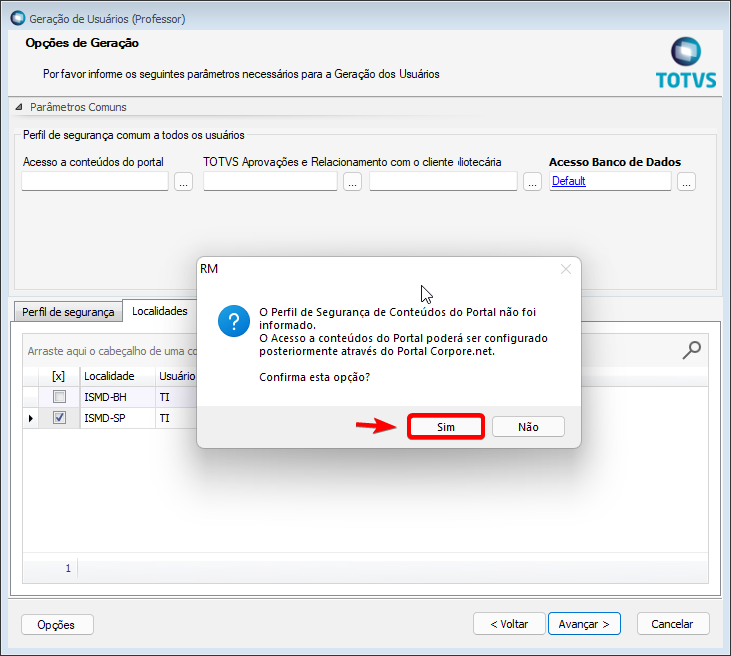
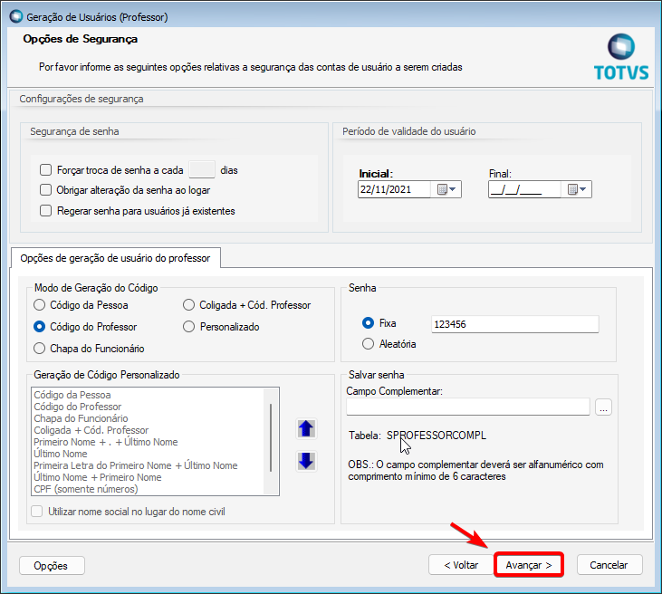
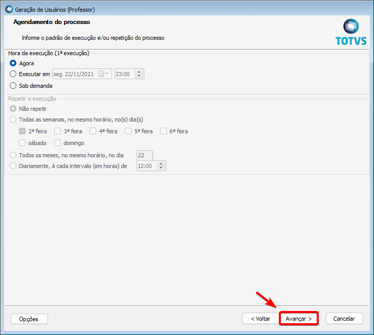
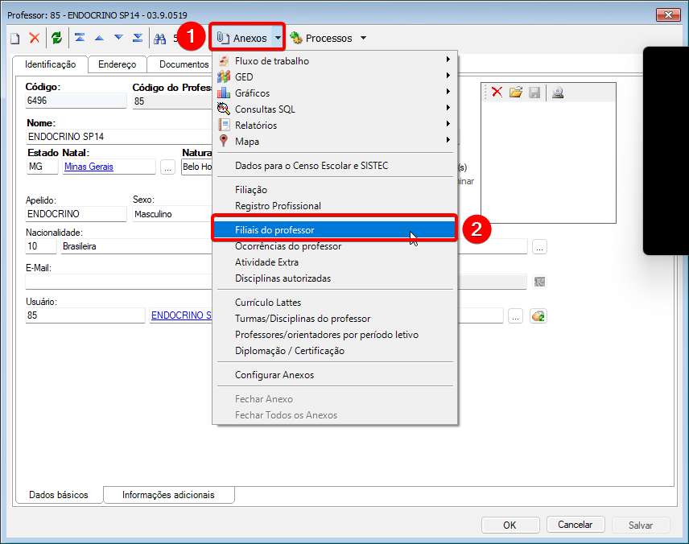

## 2.1 Clicar em **CURRICULO E OFERTA > PROFESSORES > INCLUIR.**

## 2.2.1 Na aba **IDENTIFICAÇÃO**, preencher os campos **NOME, ESTADO NATAL, NATURALIDADE e DT. NASCIMENTO**

## 2.2.2 O sistema exige um CPF no cadastro do professor, nesse caso, acessar o link https://www.4devs.com.br/gerador_de_cpf para gerar  um CPF fictício. 
***Obs. Não fechar o cadastro do professor, o CPF servirá para dar continuidade ao preenchimento do mesmo.*** 

## 2.2.3 Após gerar o CPF, acessar a aba **DOCUMENTOS** do cadastro do professor, preencher o campo **CPF**

## 2.3 Gerar usuário do professor para acesso ao portal, em **PROCESSOS > GERAÇÃO DE USUÁRIO (PROFESSOR)**

## 2.4 Clicar em **AVANÇAR**

## 2.5 Preencher os campos em negrito conforme descrito abaixo:
* ACESSO BANCO DE DADOS: **DEFAULT**
* TOTVS EDUCACIONAL: **ADMINISTRADOR DO BANCO DE DADOS**
* PORTAL: **ADMINISTRADOR DO BANCO DE DADOS**

## 2.6 Na aba **LOCALIDADES** selecionar a **LOCALIDADE** (SP ou BH) e clicar em **AVANÇAR**

## 2.7 Clicar em **SIM**

## 2.8 Clicar em **AVANÇAR**

## 2.9 Clicar em **AVANÇAR**

## 2.10 Clicar em **EXECUTAR**

## 2.11 Clicar em **FECHAR**

## 2.12 Clicar em **ANEXOS > FILIAIS DO PROFESSOR**

## 2.13 Clicar em INCLUIR e preencher a filial do professo em **CÓD. FILIAL** (1 pra BH e 2 para SP)

*Obs. A senha **123456** é gerada automaticamente na **GERAÇÃO DE USUÁRIOS (PROFESSOR)** no passo **2.3***

