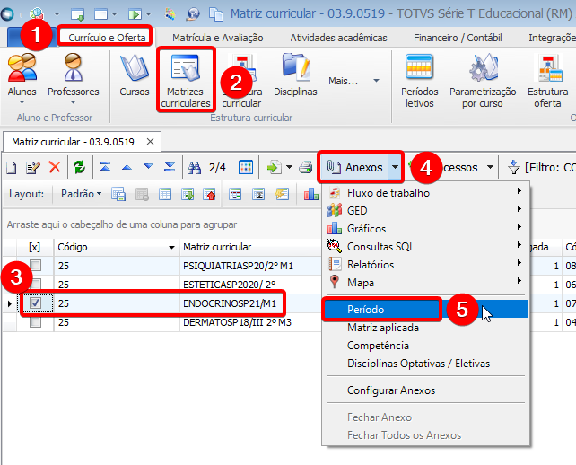
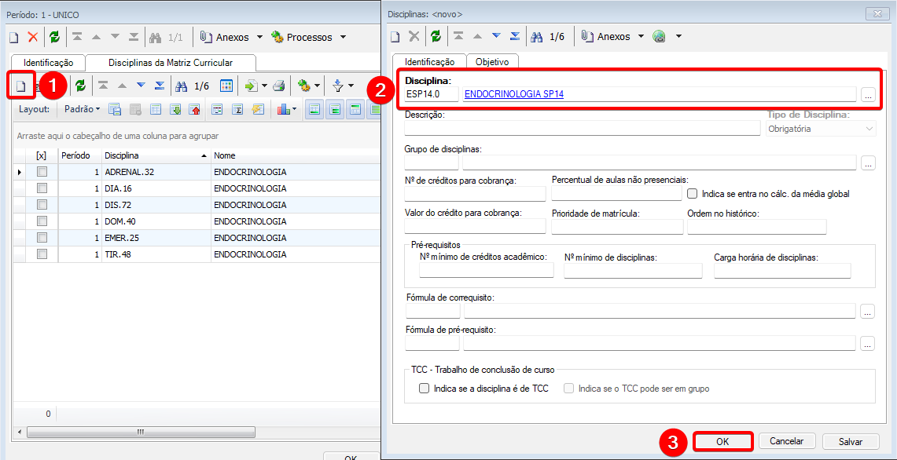
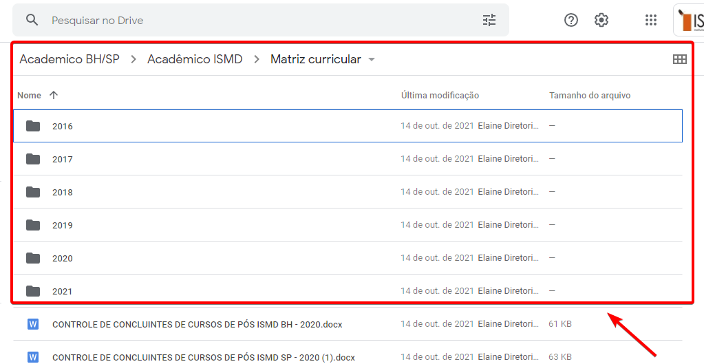

## 3.1 Acessar **CURRICULO E OFERTA > MATRIZES CURRICULARES**, selecionar a matriz correlativa a turma do curso, clicar em **ANEXOS > PERÍODO**

## 3.2 Clicar duas vezes em **ÚNICO**. Na janela que irá abrir, clicar em **ANEXOS > DISCIPLINAS DA MATRIZ CURRICULAR**

## 3.3 Clicar em **INCLUIR**.  Na janela que irá abrir, preencher o campo **DISCIPLINA** e clicar em **OK**

## 3.4 Verificar se as disciplinas da matriz curricular estão corretas de acordo com os dados armazenados  no Google Drive, no caminho **ACADÊMICO BH/SP > ACADÊMICO ISMD > MATRIZ CURRICULAR**. 

***Caso haja divergências nas Disciplinas, corrigir antes de passar para o próximo passo.***
***Repetir os passos para todas as turmas do curso.***

