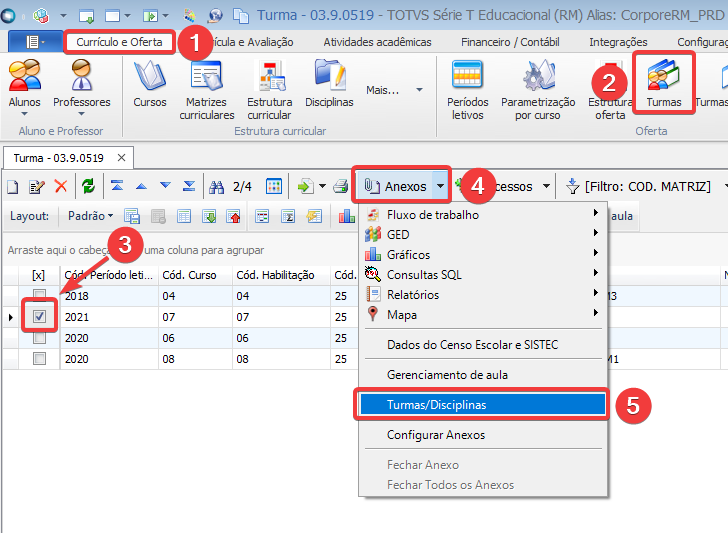
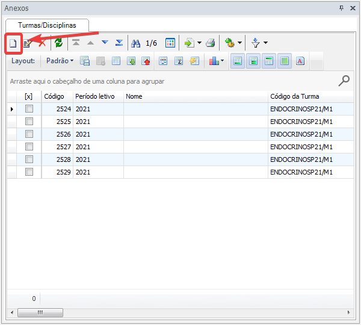
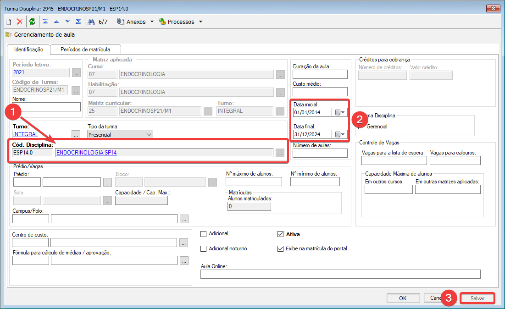

## 4.1 Clicar em Currículo e **OFERTA > TURMAS, SELECIONAR A TURMA E CLICAR EM ANEXOS > TURMAS/DISCIPLINAS**

## 4.2 Em **TURMAS/DISCIPLINAS** clicar em **INCLUIR**

## 4.3 Em **CÓD. DISCIPLINA** preencher com a disciplina criada no passo **1.3**, preenhcer **DATA INICIAL** e **DATA FINAL**, após isso clicar em **SALVAR**

