## 5.1 Para que seja possível realizar a matrícula na(s) disciplina(s) o(s) aluno(s) deve(m) estar com o status **CURSANDO** na **SITUAÇÃO DE MATRÍCULA**

## 5.1.1 Para verificar o status, acessar **MATRÍCULA E AVALIAÇÃO > MATRÍCULAS > FILTRAR OS ALUNOS PELA TURMA**
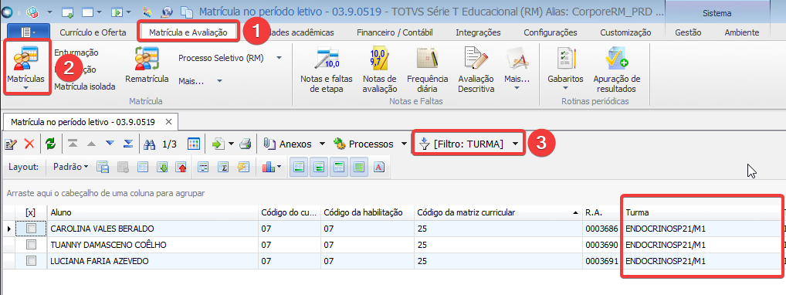

## 5.1.2 Verificar se a **SITUAÇÃO DE MATRÍCULA** está definida como **CURSANDO**
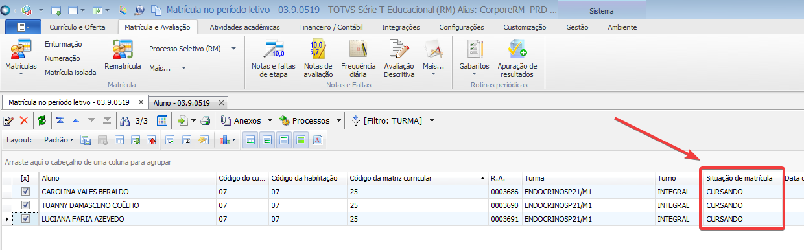

## 5.1.3 Caso a situação esteja diferente de **CURSANDO**, selecionar o(s) aluno(s), clicar em **PROCESSOS > ALTERAR SITUAÇÃO DE MATRÍCULA**
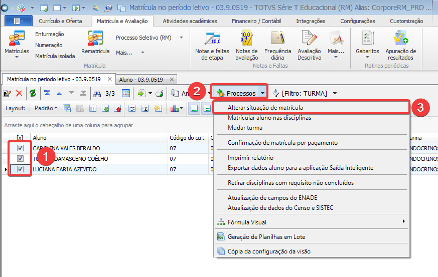

## 5.1.4 Clicar em **AVANÇAR**
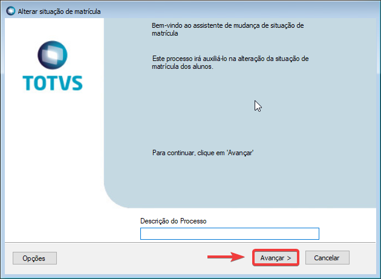

## 5.1.5 Em **NOVA SITUAÇÃO DE MATRÍCULA** selecionar **CURSANDO**, em **MOTIVO DA ALTERAÇÃO** preencher com o código **10 (ATUALIZAÇÃO)**, após isso clicar em **AVANÇAR** 
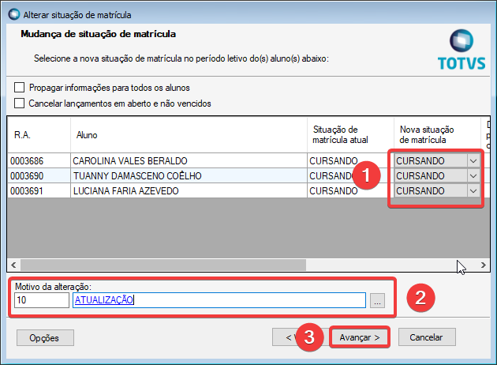

## 5.1.6 Clicar em **AVANÇAR**
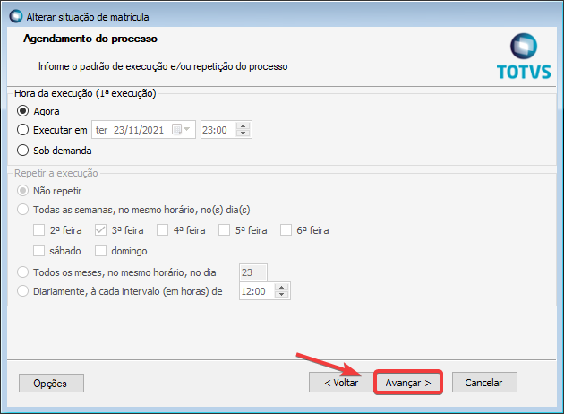

## 5.1.7 Clicar em **EXECUTAR** 
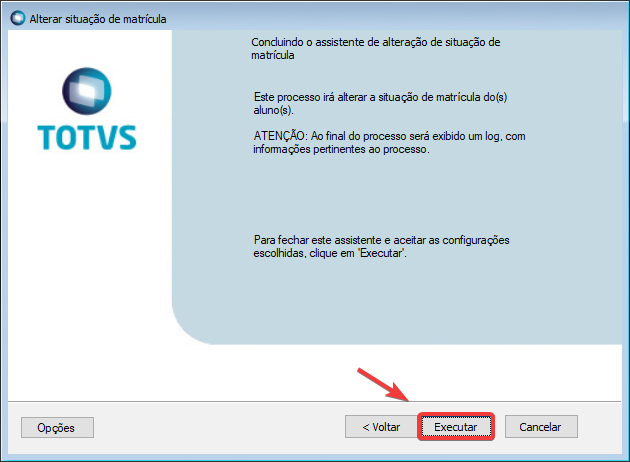

## 5.1.8 Clicar em **FECHAR**
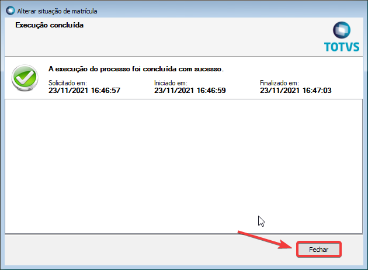

## 5.2 Após verificar/corrigir o status do(s) aluno(s) na **SITUAÇÃO DE MATRÍCULA**, clicar em **MATRÍCULA E AVALIAÇÃO > MAIS... > MATRÍCULA DE DISCIPLINAS EM LOTE**
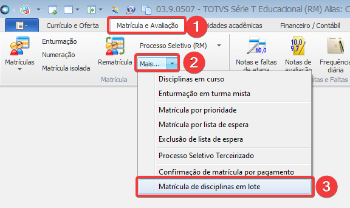

## 5.3 Clicar em **AVANÇAR**
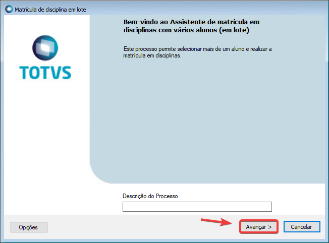

## 5.4 Preencher os campos **PERÍODO LETIVO (ANO DE INÍCIO DA TURMA), SITUAÇÃO DA MATRÍCULA (2 - CURSANDO)**, selecionar o campo **SELEÇÃO DE ALUNOS POR FILTRO** e preencher os campos **CURSO, HABILITAÇÃO, MATRIZ CURRICULAR E TURNO**, após isso, clicar em **ADICIONAR ALUNOS e AVANÇAR**. 
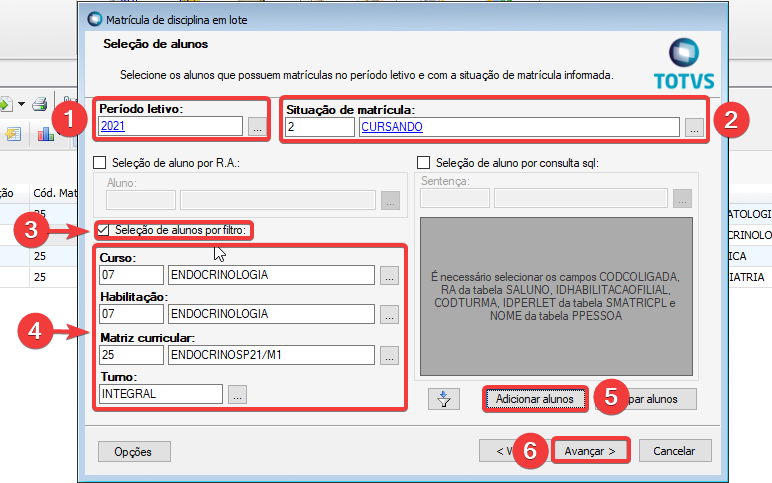

## 5.5 Selecionar os alunos da turma e clicar em **AVANÇAR**
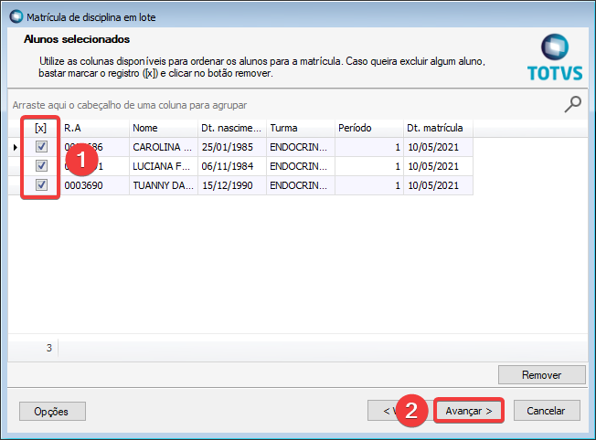

## 5.6 Preecher os campos **TURMA** e **TURMA/DISCIPLINA**, após isso clicar em **ADICIONAR**
*Obs.É possível adicionar mais disciplinas, para isso, repetir o passo acima.*
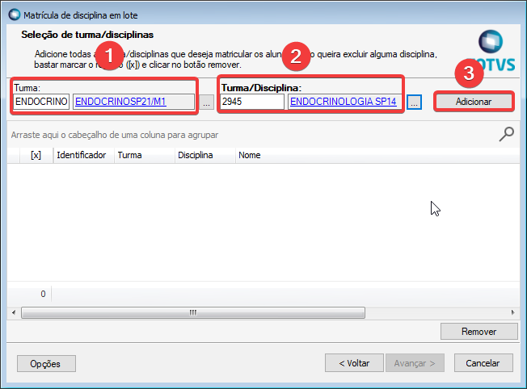

## 5.7 Selecionar a(s) disciplina(s) e clicar em **AVANÇAR**
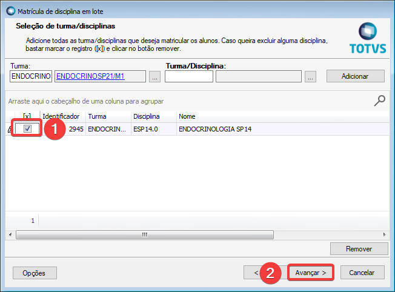

## 5.8 Clicar em **AVANÇAR**
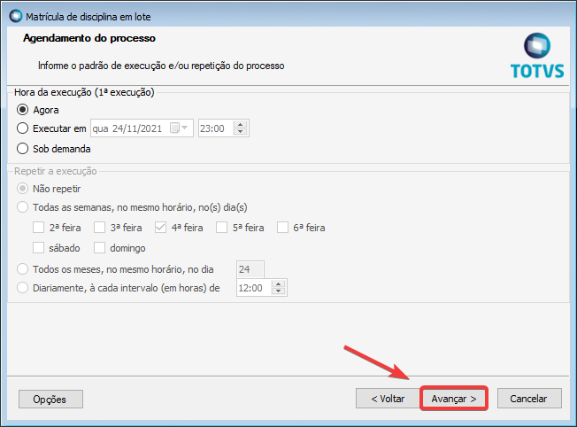

## 5.9 Clicar em **EXECUTAR** 
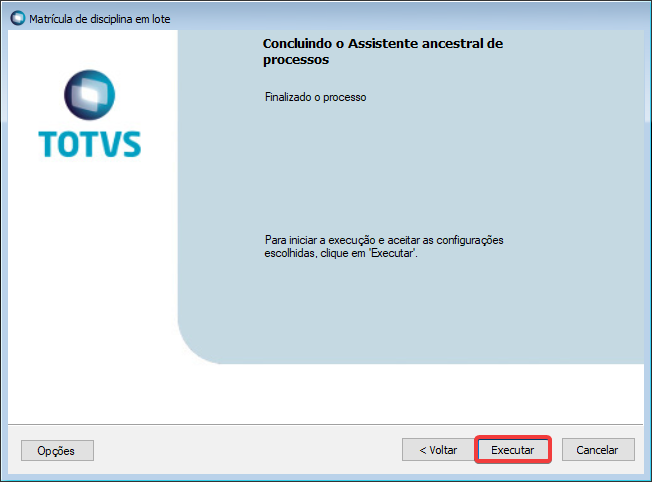

## 5.10 Clicar em **FECHAR**
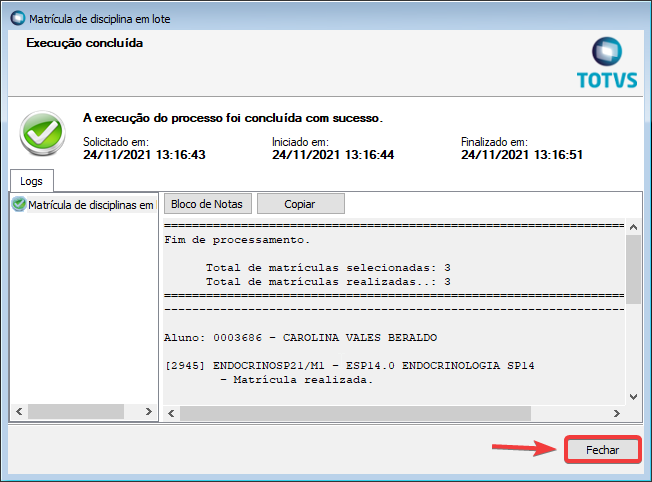