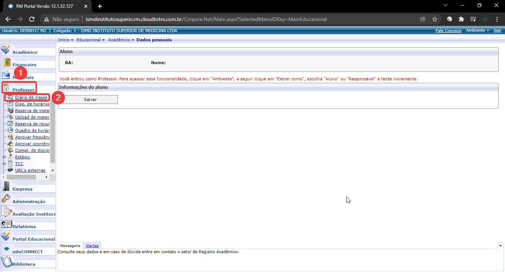

# 6. INSERIR VÍDEO AULA NO PORTAL DO ALUNO
_____________________
##  6.1.  Clicar em **CURRICULO E OFERTA** no bloco **OFERTA** clicar em **MAIS... > GERENCIAMENTO DE AULA**

## 6.2. Preencher os campos **PERÍODO LETIVO**, **TURMA** e  e clicar em **TURMA DISCIPLINA**, após isso, clicar em  SELECIONAR

## 6.3. Clicar em **INCLUIR AULA**, após isso, preencher os campos **PROFESSOR**, **DATA** e **HORA INÍCIO/FIM**

## 6.4. Clicar em **INCLUIR PROFESSOR**, após isso, preencher o campo **PROFESSOR** e Clicar em **SALVAR**

## 6.5. Clicar em **OK**

## 6.6. Acessar o **RM PORTAL** utilizando o link 'http://ismdinstitutosuperio.rm.cloudtotvs.com.br/Corpore.Net/Login.aspx', preencher os dados de **LOGIN** e **SENHA** do professor incluído no passo 6.4 e clicar em **ACESSAR**.

## 6.7. Clicar em **EDUCACIONAL**

## 6.8. Clicar em **PROFESSOR > DIÁRIO DE CLASSE**

## 6.9. Aguardar carregar o **CONTEXTO DO PROFESSOR** 

## 6.10. Selecionar a **TURMA / DISCIPLINA** correlativa à vídeo aula e clicar em **AULA ONLINE**

## 6.11. Clicar em **EDITAR**

## 6.12. Preencher o link da vídeo aula em **AULA ONLINE** e clicar em **ATUALIZAR**

## 6.13. Para visualizar a vídeo aula o aluno deve acessar o **PORTAL DO ALUNO** e clicar em **QUADRO DE HORÁRIOS**, após isso clicar no ícone da vídeo aula

## 6.14. Uma nova guia será aberta no navegador para reprodução do vídeo

