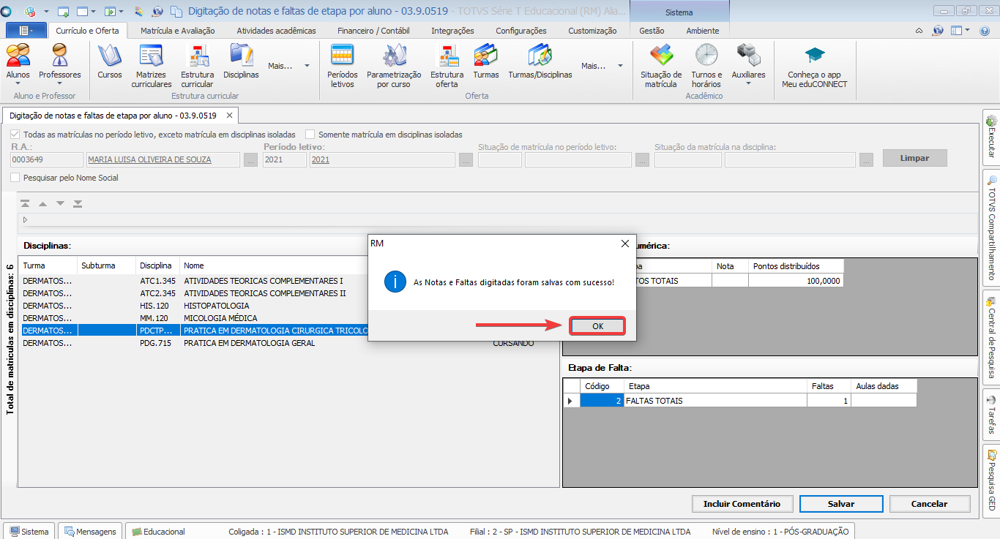

## 7.1. Clicar em **MATRÍCULA E AVALIAÇÃO**  e no bloco **NOTAS E FALTAS** clicar em **MAIS.. > DIGITAÇÃO POR ALUNO > NOTAS E FALTAS DE ETAPAS**

## 7.2. Buscar o aluno por **R.A.** ou **NOME**, após isso, preencher o **PERÍODO LETIVO** e clicar em **BUSCAR**

## 7.3. Clicar sobre a **DISCIPLINA** e preencher o campo **FALTAS**, após isso clicar na tecla **TAB** do teclado para que o preenchimento seja efetivado e clicar em **SALVAR**

## 7.4. Clicar em **OK**

## 7.5 Para visualizar as faltas o aluno deve acessar o **PORTAL DO ALUNO** e clicar em **CENTRAL DO ALUNO > FALTAS**

