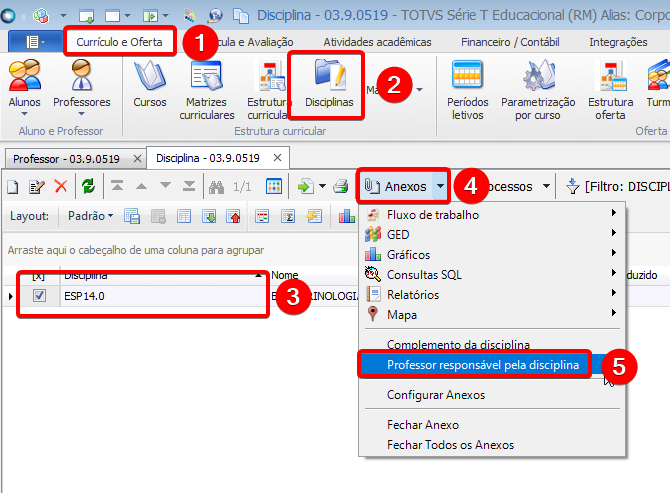

## 3.1 Acessar **CURRICULO E OFERTA > DISCIPLINAS** selecionar a disciplina criada no passo **1.3**, clicar em **ANEXOS > PROFESSOR RESPONSÁVEL PELA DISCIPLINA** 

## 3.2 Clicar em **INCLUIR**, selecionar o professor criado anteriormente e clicar em **OK**

***Repetir os passos para todas as turmas do curso.***

