You use Windows 10 Home and you want to upgrade Windows 10 Home to Windows 10 Pro free. You can find it in this article. These methods upgrade Windows 10 Home to Pro by using [Windows 10 Pro upgrade key](https://appsforpcfree.net/windows-10-upgrade-key-free/): **VK7JG-NPHTM-C97JM-9MPGT-3V66T**

But you can’t use the key in the usual way. I will guide you on how to use it below.

Contents \[[hide](#)\]

- [1 Today I will guide you how to upgrade Windows 10 Home to Pro](#today-i-will-guide-you-how-to-upgrade-windows-10-home-to-pro)
- [2 Method 1: You use cmd to upgrade Windows 10 Home to Windows 10 Pro](#method-1-you-use-cmd-to-upgrade-windows-10-home-to-windows-10-pro)
- [3 Method 2: You use Windows Setting to upgrade Windows 10 Home to Pro](#method-2-you-use-windows-setting-to-upgrade-windows-10-home-to-pro)
- [4 Method 3: You use media creation tool to reinstall Windows 10 Home without losing data. Then you use method 1 again to upgrade Windows 10 Home to Pro](#method-3-you-use-media-creation-tool-to-reinstall-windows-10-home-without-losing-data-then-you-use-method-1-again-to-upgrade-windows-10-home-to-pro)
- [5 Method 4: You install new Windows 10 Pro to replace the old Windows 10 Home](#method-4-you-install-new-windows-10-pro-to-replace-the-old-windows-10-home)
- [6 Method 5: You change SKUs to upgrade Windows 10 Home to Pro](#method-5-you-change-skus-to-upgrade-windows-10-home-to-pro)

## **Today I will guide you how to upgrade Windows 10 Home to Pro**

**Note**: Because these methods help you upgrade Windows 10 Home to Pro for free, so you will lose Windows 10 Home license. After you upgrade Windows 10 Home to Pro, you need to buy Windows 10 Pro product key to activate it. I also sell [cheap Windows 10 Pro product key](https://saleproductkey.com/product/cheap-windows-10-pro-product-key/) ($25/key) on [https://saleproductkey.com](https://saleproductkey.com/)

## **Method 1: You use cmd to upgrade Windows 10 Home to Windows 10 Pro**

(Applies to: Windows 10 Home, Windows 10 Home Single Language)

**Step 1**: You open **cmd** (run as administrator)

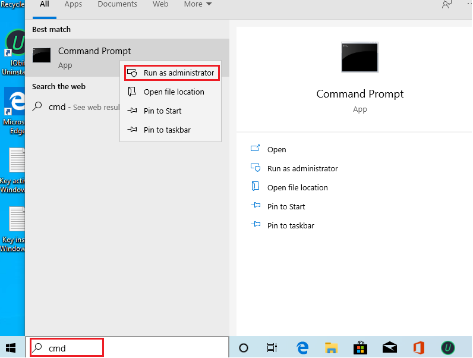

**Step 2**: You type one by one these codes in cmd

**slmgr.vbs /upk
slmgr.vbs /cpky**
**slmgr.vbs /ckms**

**Step 3**: Then you type

**DISM /online /Get-TargetEditions**

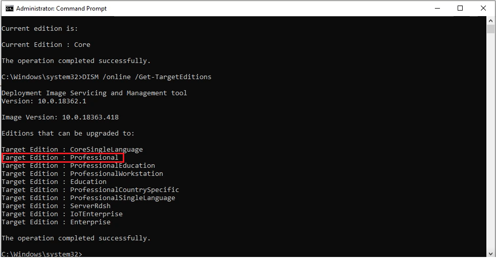

- If you see **Target edition: Professional**, your Windows 10 Home can upgrade to Windows 10 Pro.
- If you don’t see **Target edition: Professional**, you do as method 3, 4, 5.

**Step 4**: You type these codes in cmd

**sc config LicenseManager start= auto & net start LicenseManager**
**sc config wuauserv start= auto & net start wuauserv
changepk.exe /productkey VK7JG-NPHTM-C97JM-9MPGT-3V66T
exit**

Then you enter and wait for a moment.

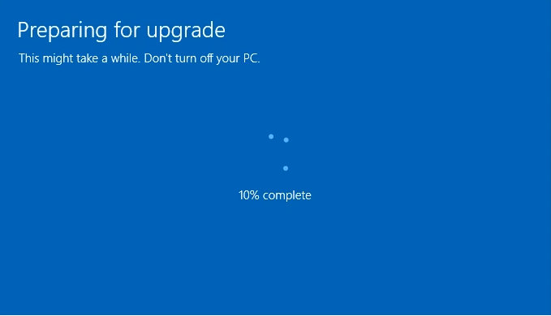

**Step 5**: If you use Windows 10 version 20H2, 21H1, you will see error0x80070005. You restart Windows 10 to complete upgradation.

**You can watch this video to know how to use cmd to upgrade Windows 10 Home to Pro by cmd:
**

**Note**:

1\. If you can’t upgrade Windows 10 Home to Pro and you lose the Windows 10 Home license. You type this code in cmd to reactivate Windows 10 Home

**slmgr.vbs /ipk YTMG3-N6DKC-DKB77-7M9GH-8HVX7**

2\. If you see the error, you use method 3. This error means your Windows 10 has error and you need to fix it.

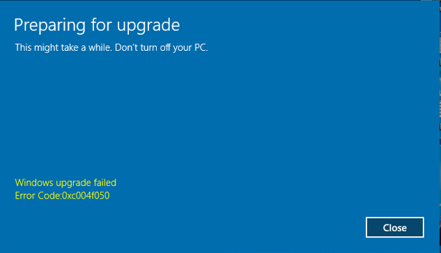

## **Method 2: You use Windows Setting to upgrade Windows 10 Home to Pro**

**This method now can’t use**

**Step 1**: You open “**Activation Setting**”

**Step 2**: You click “**Change product key**“. Then you paste the [Windows 10 upgrade key](https://appsforpcfree.net/windows-10-upgrade-key/) here:

**Windows 10 Pro upgrade key: VK7JG-NPHTM-C97JM-9MPGT-3V66T**

**Note:**

- You need to **turn off your wifi** before you click “**Next**” and turn it back on when the update is 10% or more to complete
- If you have **Windows 10 Home license**, you will lose the license when you upgrade Windows 10 Home to Pro free.

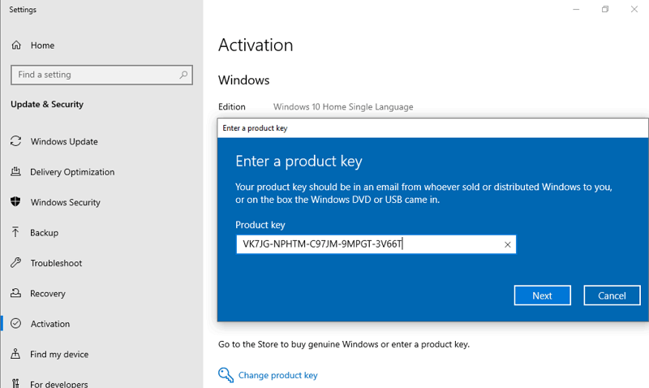

Then you click “**Next**“.

**Step 3**: You click “**Start**” to begin upgrading Windows 10 Home to Windows 10 Pro

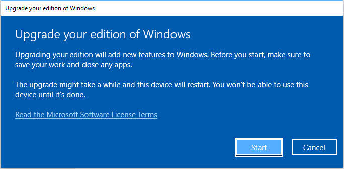

**You can watch this video to know how to upgrade Windows 10 Home to Windows 10 Pro by Windows Setting
**

With this method, you can:

- Upgrade Windows 10 Home to Pro
- Upgrade Windows 10 Home Single Language to Pro

## **Method 3: You use media creation tool to reinstall Windows 10 Home without losing data. Then you use method 1 again to upgrade Windows 10 Home to Pro
**

**Step 1**: You visit here to download media creation tool https://www.microsoft.com/en-us/software-download/windows10

**Step 2**: You click “**Download tool now**”

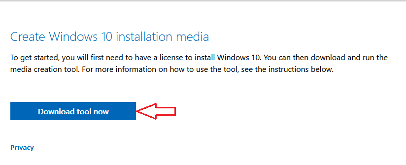

**Step 3**: You install this tool

**Step 4**: You use the tool to reinstall Windows 10. You accept Microsoft software license terms to start reinstalling Windows 10

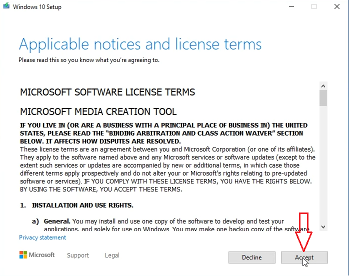

**Step 5**: You select “**Keep personal files and apps**” to reinstall Windows 10 without losing data => Then you click **Install**

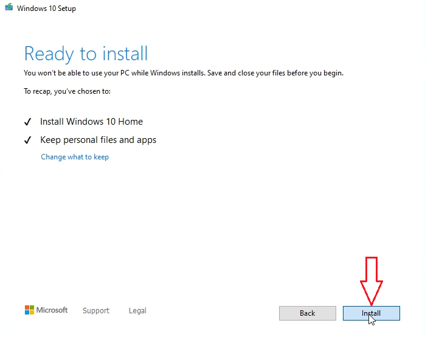

Done. You wait for a moment to reinstall Windows 10.

Then you **use method 1 again**.

You can watch this video to know how to reinstall Windows 10

## **Method 4: You install new Windows 10 Pro to replace the old Windows 10 Home**

**Note**: You **back up** your data first before you reinstall Windows 10 Pro. You copy data from C drive to D or E drive. You also copy data from Desktop to D or E drive. If you don’t want to reinstall Windows 10, you use method 5.

**Step 1**: You download Wintohdd here: https://www.easyuefi.com/wintohdd/index.html

**Step 2**: You install Wintohdd

**Step 3**: You download Windows 10 Pro iso from Microsoft: https://appsforpcfree.net/download-windows-10-iso-from-microsoft-2020/

Then you move Windows 10 iso file to the D drive or E drive. You **don’t put Windows 10 iso file on the C drive** because Wintohdd will delete all data on the C drive

**Step 4**: You open Wintohdd, then you select “**Reinstall Windows**”

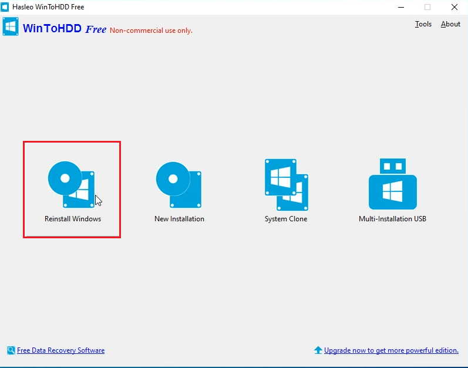

**Step 5**: You click the  button, then you select Windows 10 iso file you want to install

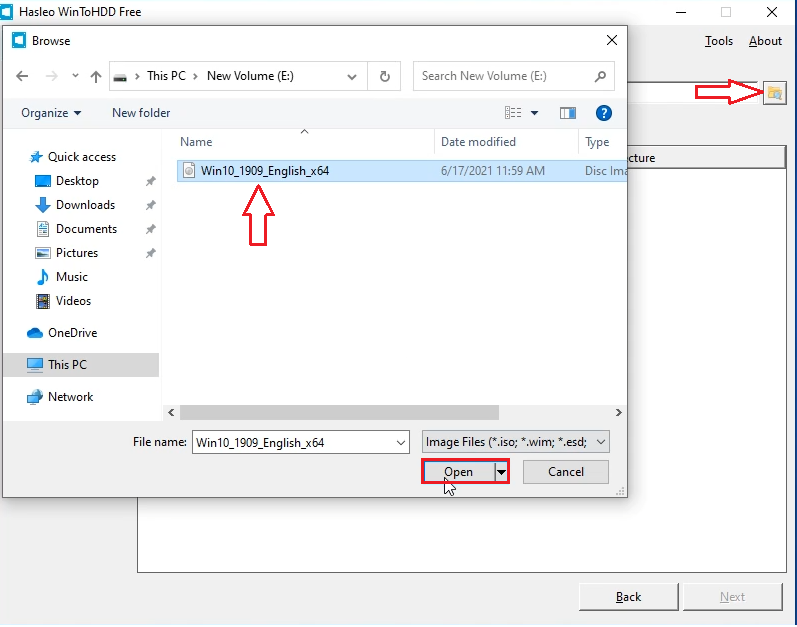

**Step 6**: You select Windows 10 Pro to install Windows 10 Pro. Then you click **Next**

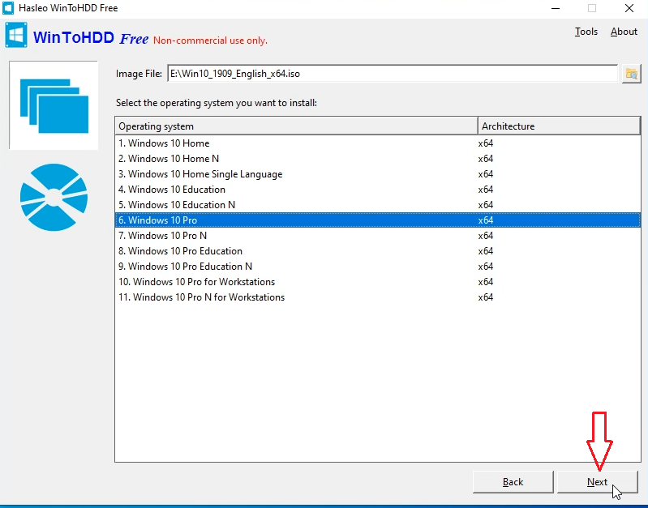

**Step 7**: You select **Next** and Wintohdd will ask you to create a WinPE image. You select **Yes**

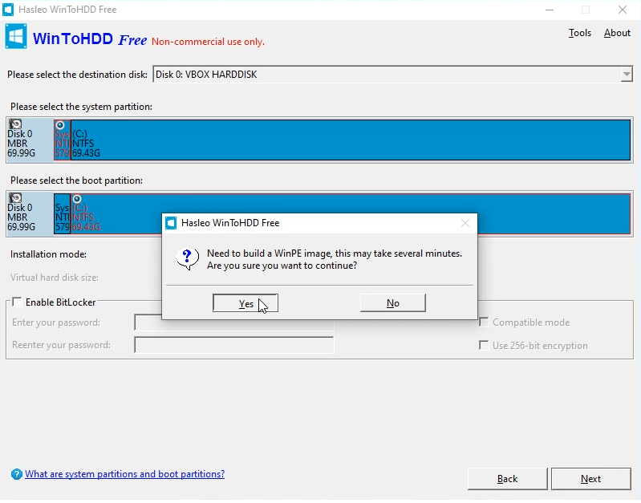

**Step 8**: After successfully built the WinPE image, WinToHDD will prompt you to reboot the computer. You click “**Yes**” button to allow WinToHDD to reboot your computer.

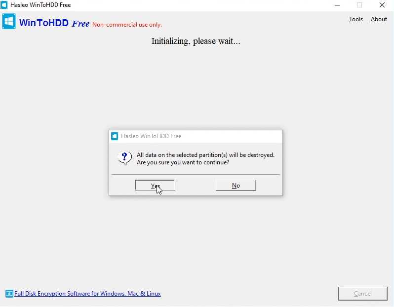

Done. You wait for a moment to Wintohdd install Windows 10 Pro.

You can watch this video to know how to install Windows 10 Pro by Wintohdd

## **Method 5: You change SKUs to upgrade Windows 10 Home to Pro**

I will explain this method. You add Windows 10 Pro profile. [Media creation tool](https://appsforpcfree.net/use-windows-10-media-creation-tool/) will think you use Windows 10 Pro while you are still using Windows 10 Home. So when you use media creation tool to [reinstall Windows 10 without losing data](https://appsforpcfree.net/reinstall-windows-10-without-losing-data/), the tool will reinstall Windows 10 Pro. If you don’t add Windows 10 Pro profile, when you use media creation tool, the tool will reinstall Windows 10 Home. This method takes long time but I’m sure it works 100%.

**Step 1**: You download SKUs of Windows 10 Pro [here](https://appsforpcfree.net/skus-Windows-10.zip)

**Step 2**: You extract the SKUs of Windows 10 Pro which you download

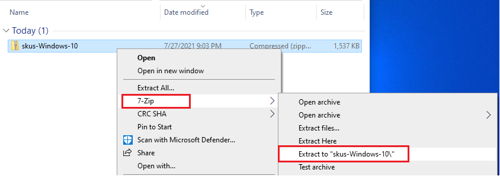

Now you have skus-Windows-10 folder. You open skus-Windows-10 folder, then you copy all folders on it to **C:\\Windows\\System32\\spp\\tokens\\skus**

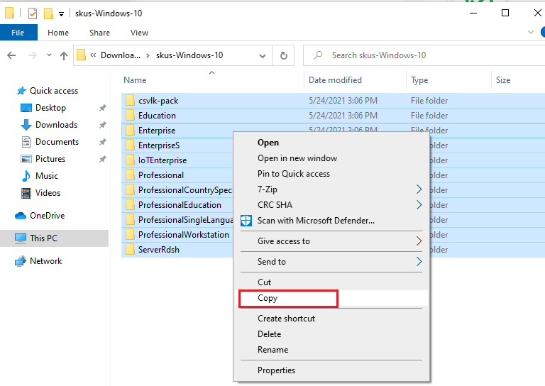

**Step 3**: You cope all folders on skus-Windows-10 folder to **C:\\Windows\\System32\\spp\\tokens\\skus**

( You press Win + R to open **Run,** Then you type: **C:\\Windows\\System32\\spp\\tokens\\skus** to open it**)**

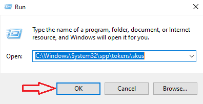

**Step 4**: You open **cmd** (run as administrator)

Then you copy and paste these codes:

cscript.exe %windir%\\system32\\slmgr.vbs /rilc
cscript.exe %windir%\\system32\\slmgr.vbs /upk >nul 2>&1
cscript.exe %windir%\\system32\\slmgr.vbs /ckms >nul 2>&1
cscript.exe %windir%\\system32\\slmgr.vbs /cpky >nul 2>&1
cscript.exe %windir%\\system32\\slmgr.vbs /ipk VK7JG-NPHTM-C97JM-9MPGT-3V66T
sc config LicenseManager start= auto & net start LicenseManager
sc config wuauserv start= auto & net start wuauserv
clipup -v -o -altto c:\
echo

**Step 5**: You use [media creation tool](https://appsforpcfree.net/use-windows-10-media-creation-tool/) to reinstall Windows 10 to complete this upgradation.

Done.

You can watch this video to know how to upgrade Windows 10 Home to Pro by changing SKUs

If you only want to change Windows 10 Home Single Language to Windows 10 Home, you read this article: https://appsforpcfree.net/change-windows-10-home-single-language-windows-10-home/

I also sell [Windows 10 Pro product key](https://saleproductkey.com/product/cheap-windows-10-pro-product-key/), [Windows 10 Home product key](https://saleproductkey.com/product/windows-10-home-product-key-lifetime/) ($25/key). If you want to buy it you can visit https://saleproductkey.com/

Tag: How to upgrade Windows 10 Home to Pro, windows 10 home to pro upgrade key free, upgrade windows 10 home to pro free, windows 10 pro upgrade, upgrade to windows 10 pro free, Windows 10 Pro upgrade key, how to upgrade windows 10 home single language to pro

**Read more:**

- [Windows 10 ISO Download](https://appsforpcfree.net/download-windows-10-iso-from-microsoft-2020/)
- [How to Disable Windows 10 Update](https://appsforpcfree.net/how-to-disable-windows-10-update-permanently/)
- [Upgrade Windows 10 Pro to Enterprise](https://appsforpcfree.net/upgrade-windows-10-pro-enterprise-education/)